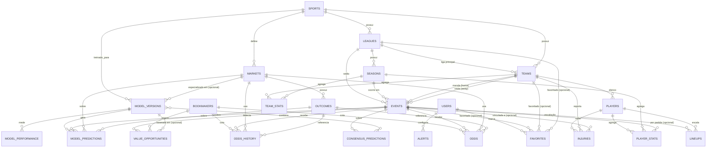

# BetEdge — Documento de Design de Banco de Dados

**Plataforma profissional de estatísticas e valor esperado para apostas esportivas**
**Motor:** Supabase (PostgreSQL 15+) · **Schema principal:** `public` · **Versão do documento:** 1.0
**Data:** 2026-08-28

---

## Sumário

1. [Visão geral e princípios de design](#1-visão-geral-e-princípios-de-design)
2. [Convenções gerais](#2-convenções-gerais)
3. [Extensões e configuração inicial](#3-extensões-e-configuração-inicial)
4. [Diagrama entidade-relacionamento](#4-diagrama-entidade-relacionamento)
5. [Entidades centrais](#5-entidades-centrais) — `users`, `sports`, `leagues`, `seasons`, `teams`, `players`
6. [Eventos](#6-eventos) — `events`, `lineups`, `injuries`
7. [Odds e mercados](#7-odds-e-mercados) — `bookmakers`, `markets`, `outcomes`, `odds`, `odds_history`
8. [Estatísticas](#8-estatísticas) — `team_stats`, `player_stats`
9. [Modelos e previsões](#9-modelos-e-previsões) — `model_versions`, `model_predictions`, `consensus_predictions`, `model_performance`
10. [Valor e análise](#10-valor-e-análise) — `value_opportunities`, `alerts`, `favorites`
11. [Particionamento](#11-particionamento)
12. [Estratégia de índices](#12-estratégia-de-índices)
13. [Row Level Security (RLS)](#13-row-level-security-rls)
14. [Views materializadas](#14-views-materializadas)
15. [Funções e triggers](#15-funções-e-triggers)
16. [Seed data](#16-seed-data)
17. [Auditoria, validação walk-forward e retenção](#17-auditoria-validação-walk-forward-e-retenção)
18. [Ordem de execução das migrations](#18-ordem-de-execução-das-migrations)

---

## 1. Visão geral e princípios de design

O BetEdge é uma plataforma SaaS que:

- coleta e armazena **odds de múltiplas casas de apostas** ao longo do tempo (séries temporais imutáveis);
- gera **previsões de modelos estatísticos/ML** e uma **previsão de consenso** entre eles;
- cruza previsões com odds de mercado para detectar **oportunidades de valor** (edge positivo);
- avalia a **performance histórica dos modelos** com rigor de **validação walk-forward** (nunca usar dado do futuro para prever o passado);
- opera sob **regulação brasileira de apostas esportivas** (SPA/MF — Secretaria de Prêmios e Apostas do Ministério da Fazenda), rastreando quais casas estão autorizadas;
- é **multi-tenant** (cada usuário autenticado enxerga apenas os próprios dados privados — alertas, favoritos, preferências) com **planos de assinatura** que controlam o nível de acesso aos dados analíticos (odds históricas, previsões, oportunidades de valor).

### 1.1 Decisões arquiteturais fundamentais

| Decisão | Motivo |
|---|---|
| `odds_history` é **append-only** (nunca `UPDATE`/`DELETE`) | Permite reconstruir o estado exato do mercado em qualquer instante do passado — essencial para calcular *Closing Line Value* (CLV) e auditar decisões de modelo. Aplicado via trigger `BEFORE UPDATE/DELETE` que sempre lança exceção (ver §15.5), e via `REVOKE UPDATE, DELETE` do papel da aplicação. |
| `model_predictions` é **append-only** | Uma previsão é uma fotografia do que o modelo achava **naquele momento**, com os dados disponíveis **naquele momento**. Se o resultado do jogo alterasse a previsão gravada, a base deixaria de servir para validação — passaríamos a "prever o passado com o futuro" (*data leakage*). Por isso, o **resultado da previsão (acerto/erro) nunca é gravado por `UPDATE` na própria linha** — é sempre **derivado** via `JOIN` com `events` no momento da consulta (ver função `fn_grade_prediction`, §15.6, e view `v_prediction_results`, §14.5). |
| `odds` (tabela "atual") existe **separada** de `odds_history` | `odds` é uma *materialização* mutável do último estado (1 linha por evento×casa×mercado×resultado), mantida por trigger a partir do append em `odds_history`. Serve para consultas rápidas de "odd agora" sem escanear a série histórica. |
| Tipos "enum" implementados como `text` + `CHECK` | Alterar um `CHECK` é uma operação leve; alterar um `ENUM` nativo do Postgres (adicionar valor é ok, remover/renomear não) trava a tabela e é irreversível sem recriar o tipo. Como o catálogo de mercados, status etc. deve evoluir com frequência, preferimos `CHECK`. |
| Chaves primárias `uuid` (`gen_random_uuid()`) | Evita coordenação de sequência entre serviços de ingestão distribuídos (scrapers, workers, Edge Functions) e não vaza contagem de linhas. |
| Particionamento por mês em `odds_history` e `model_predictions` | Ambas são tabelas de séries temporais que crescem indefinidamente (milhões de linhas/mês). Particionar por `recorded_at`/`generated_at` mantém índices pequenos, acelera `VACUUM`, permite *retenção* barata (fazer `DETACH PARTITION` em vez de `DELETE`) e paraleliza varreduras. |
| RLS habilitado em **todas** as tabelas do schema `public` | Postura *secure by default* do Supabase: mesmo tabelas "públicas" (catálogo de ligas, times) têm RLS habilitado com uma policy explícita de leitura, em vez de depender de `GRANT` de schema. |

---

## 2. Convenções gerais

- **Idioma:** nomes de tabelas/colunas em inglês (padrão da comunidade Postgres/Supabase); comentários de schema (`COMMENT ON …`) e este documento em **pt-BR**.
- **Nomenclatura:** `snake_case` em tudo — tabelas, colunas, índices, constraints, funções. Tabelas no plural (`teams`, `events`). Chaves estrangeiras nomeadas `<tabela_singular>_id` (ex.: `team_id`, `event_id`).
- **Chave primária:** `id uuid primary key default gen_random_uuid()` em toda tabela, exceto as particionadas (`odds_history`, `model_predictions`), cuja PK é composta `(id, <coluna_de_particionamento>)` — exigência do Postgres para tabelas particionadas por `RANGE`.
- **Timestamps:** sempre `timestamptz` (UTC internamente; conversão para fuso do usuário fica na camada de apresentação). `created_at timestamptz not null default now()` em toda tabela; `updated_at timestamptz not null default now()` em toda tabela **mutável**, mantido por trigger genérico (`trg_set_updated_at`, §15.1). Tabelas append-only (`odds_history`, `model_predictions`) **não têm** `updated_at` — não fazem sentido, pois a linha nunca muda.
- **Odds decimais:** `numeric(10,4)` — 4 casas decimais cobrem a granularidade usada por casas europeias/asiáticas (ex.: `1.9091`) sem erro de ponto flutuante.
- **Probabilidades:** `numeric(8,6)` — 6 casas decimais (ex.: `0.523810`), suficiente para diferenças de edge de frações de ponto percentual.
- **Dinheiro:** não há valores monetários nominais neste schema (BetEdge não processa apostas reais, apenas análise); caso seja adicionado no futuro, usar `numeric(14,2)` com coluna de moeda ISO 4217.
- **Exclusão lógica (*soft delete*):** tabelas de catálogo que podem precisar "desaparecer" da UI sem quebrar integridade referencial de histórico (`teams`, `leagues`, `players`, `bookmakers`, `users`) têm `deleted_at timestamptz`. Nunca fazemos `DELETE` físico nessas tabelas — eventos/odds/previsões antigos continuam apontando para o registro.
- **JSONB:** usado para (a) dados de forma variável entre provedores (`external_ids`), (b) parâmetros configuráveis sem migration (`hyperparameters`, `conditions`), (c) auditoria de payload bruto (`raw_payload`, `features_snapshot`). Sempre `not null default '{}'::jsonb` (nunca `null` solto) e sempre com índice `GIN` quando consultado.
- **Domínios de texto controlado:** implementados com `check (coluna in (...))`. A lista de valores válidos é documentada no comentário da coluna.
- **Comentários de schema:** toda tabela e toda coluna não óbvia recebe `COMMENT ON TABLE`/`COMMENT ON COLUMN` (omitidos do corpo deste markdown por brevidade visual, mas presentes nas migrations reais — ver bloco de exemplo no §18).
- **Schema único:** todas as tabelas de aplicação vivem em `public`. Não usamos schemas separados por tenant — o isolamento multi-tenant é feito inteiramente por RLS (ver §13), não por schema.

---

## 3. Extensões e configuração inicial

```sql
-- 001_extensions.sql
-- Extensões necessárias. pgcrypto e pgjwt já vêm habilitadas por padrão em projetos Supabase.
create extension if not exists "pgcrypto";     -- gen_random_uuid()
create extension if not exists "pg_trgm";       -- busca fuzzy em nomes de time/jogador/liga (ILIKE acelerado)
create extension if not exists "btree_gin";     -- índices GIN compostos (ex.: status + jsonb)
create extension if not exists "pg_cron";       -- agendamento de manutenção de partições e refresh de views
create extension if not exists "pg_stat_statements"; -- observabilidade de queries lentas
```

> No Supabase, `pg_cron` e `pg_net` são habilitados via *dashboard* (Database → Extensions) ou projeto self-hosted; os `CREATE EXTENSION` acima assumem que o role de migration tem privilégio de superusuário/`supabase_admin`, como é o padrão do pipeline de migrations do Supabase CLI.

---

## 4. Diagrama entidade-relacionamento



### 4.1 Relacionamentos por extenso

| De | Para | Cardinalidade | Nota |
|---|---|---|---|
| `sports` → `leagues` | 1:N | uma liga pertence a um esporte |
| `leagues` → `seasons` | 1:N | uma liga tem várias temporadas ao longo do tempo |
| `leagues` → `teams` | 1:N (opcional) | `teams.league_id` é a liga "principal"/mais recente do time — times mudam de liga (acesso/rebaixamento), o histórico real de participação vive em `events.league_id` |
| `teams` → `players` | 1:N (opcional) | jogador sem clube tem `team_id null` |
| `events` → `teams` (×2) | N:1 | `home_team_id` e `away_team_id`, ambos `not null`, com `check (home_team_id <> away_team_id)` |
| `events` → `leagues`, `seasons` | N:1 | toda partida pertence a uma liga; `season_id` pode ser nulo durante ingestão parcial |
| `events` → `lineups` | 1:N | uma linha por jogador escalado |
| `events` → `injuries` | 1:N (opcional) | vínculo direto quando o problema físico/suspensão está ligado a uma partida específica |
| `bookmakers`, `events`, `markets`, `outcomes` → `odds` | N:1 (×4) | 1 linha viva por combinação (`unique`) |
| idem → `odds_history` | N:1 (×4) | N linhas por combinação ao longo do tempo (append-only) |
| `teams`, `seasons` → `team_stats` | N:1 | 1 linha por (time, temporada, corte temporal `as_of_event_id`) |
| `players`, `seasons`, `events` → `player_stats` | N:1 | `event_id null` = agregado de temporada; preenchido = stats de uma partida |
| `model_versions` → `model_predictions` | 1:N | append-only |
| `events`, `markets`, `outcomes` → `model_predictions` | N:1 | |
| `model_versions` → `model_performance` | 1:N | uma linha por janela de avaliação |
| `events` → `consensus_predictions` | 1:N | combina N `model_versions` (array de IDs) |
| `events`, `bookmakers`, `markets`, `outcomes` → `value_opportunities` | N:1 | opcionalmente referencia `model_versions`/`consensus_predictions`/`model_predictions` |
| `users` → `alerts`, `favorites` | 1:N | dados privados por usuário (tenant) |

---

## 5. Entidades centrais

### 5.1 `users`

Estende `auth.users` do Supabase (não duplica e-mail/senha — isso é responsabilidade do GoTrue). `id` é o mesmo UUID de `auth.users.id`.

```sql
-- 010_users.sql
create table public.users (
  id                       uuid primary key references auth.users (id) on delete cascade,
  email                    text not null,
  display_name             text,
  avatar_url               text,
  subscription_tier        text not null default 'free'
                             check (subscription_tier in ('free','basic','pro','enterprise')),
  subscription_status      text not null default 'active'
                             check (subscription_status in ('active','trialing','past_due','canceled','paused')),
  subscription_renews_at   timestamptz,
  stripe_customer_id       text unique,
  stripe_subscription_id   text unique,
  timezone                 text not null default 'America/Sao_Paulo',
  locale                   text not null default 'pt-BR',
  favorite_sport_id        uuid references public.sports (id) on delete set null,
  preferences              jsonb not null default '{}'::jsonb,
  role                     text not null default 'user'
                             check (role in ('user','analyst','admin','service')),
  onboarded_at             timestamptz,
  last_seen_at             timestamptz,
  deleted_at               timestamptz,
  created_at               timestamptz not null default now(),
  updated_at               timestamptz not null default now()
);

comment on table public.users is
  'Perfil de aplicação por usuário autenticado. 1:1 com auth.users. Tenant raiz do modelo multi-tenant do BetEdge.';
comment on column public.users.preferences is
  'Ex.: {"odds_format":"decimal","followed_leagues":["..."],"theme":"dark","default_stake":100}';
comment on column public.users.role is
  'user = assinante comum; analyst = acesso de leitura estendido (dashboards internos); admin = acesso total; service = contas técnicas (workers/Edge Functions).';

create index users_subscription_tier_idx on public.users (subscription_tier) where deleted_at is null;
create index users_role_idx on public.users (role) where role <> 'user';
```

> `sports` é referenciada aqui antes de ser criada em §5.2 — na ordem real de migrations, `sports` vem primeiro (ver §18). A FK é adicionada depois via `alter table` ou a ordem das migrations é invertida; este documento agrupa por tema, não por ordem de criação.

**Trigger de provisionamento:** ao criar um usuário em `auth.users`, uma função `handle_new_user()` cria automaticamente a linha correspondente em `public.users` (ver §15.2).

### 5.2 `sports`

```sql
-- 011_sports.sql
create table public.sports (
  id             uuid primary key default gen_random_uuid(),
  code           text not null unique,          -- 'football'
  name           text not null,                 -- 'Football / Soccer'
  name_pt        text not null,                 -- 'Futebol'
  icon           text,                           -- nome do ícone (lucide/heroicons) ou emoji
  active         boolean not null default true,
  display_order  smallint not null default 0,
  created_at     timestamptz not null default now(),
  updated_at     timestamptz not null default now()
);

comment on table public.sports is
  'Catálogo de esportes suportados. Inicialmente apenas futebol; schema já preparado para expansão (basquete, tênis etc.).';

create index sports_active_idx on public.sports (display_order) where active;
```

### 5.3 `leagues`

```sql
-- 012_leagues.sql
create table public.leagues (
  id                     uuid primary key default gen_random_uuid(),
  sport_id               uuid not null references public.sports (id) on delete restrict,
  name                   text not null,
  short_name             text,
  country_code           char(2),                 -- ISO 3166-1 alpha-2; null = competição internacional
  country_name           text,
  confederation          text
                           check (confederation in ('UEFA','CONMEBOL','CONCACAF','AFC','CAF','OFC', null)),
  tier                   smallint not null default 1,   -- 1 = elite nacional (ex.: Série A), 2 = Série B...
  gender                 text not null default 'male'
                           check (gender in ('male','female','mixed')),
  logo_url               text,
  provider               text not null,           -- fonte primária de dados, ex.: 'api-football'
  provider_league_id     text not null,
  external_ids           jsonb not null default '{}'::jsonb,  -- mapeamento multiprovedor: {"sportmonks":"8","opta":"..."}
  active                 boolean not null default true,
  deleted_at             timestamptz,
  created_at             timestamptz not null default now(),
  updated_at             timestamptz not null default now(),
  unique (sport_id, provider, provider_league_id)
);

comment on table public.leagues is
  'Catálogo de competições/ligas. tier distingue divisões dentro de um país (1=principal).';
comment on column public.leagues.external_ids is
  'Mapeamento para IDs de outros provedores de dados além do provider primário, permitindo casamento (matching) cruzado sem duplicar linhas.';

create index leagues_sport_active_idx on public.leagues (sport_id) where active and deleted_at is null;
create index leagues_country_idx on public.leagues (country_code);
create index leagues_external_ids_gin on public.leagues using gin (external_ids);
create index leagues_name_trgm on public.leagues using gin (name gin_trgm_ops);
```

### 5.4 `seasons`

```sql
-- 013_seasons.sql
create table public.seasons (
  id             uuid primary key default gen_random_uuid(),
  league_id      uuid not null references public.leagues (id) on delete cascade,
  name           text not null,               -- '2025/2026' ou '2026'
  start_date     date not null,
  end_date       date,
  is_current     boolean not null default false,
  external_ids   jsonb not null default '{}'::jsonb,
  created_at     timestamptz not null default now(),
  updated_at     timestamptz not null default now(),
  unique (league_id, name),
  check (end_date is null or end_date >= start_date)
);

comment on table public.seasons is
  'Temporadas de cada liga. is_current identifica a temporada vigente para consultas default da UI.';

-- Garante no máximo UMA temporada corrente por liga (índice único parcial).
create unique index seasons_one_current_per_league
  on public.seasons (league_id) where is_current;

create index seasons_league_dates_idx on public.seasons (league_id, start_date desc);
```

### 5.5 `teams`

```sql
-- 014_teams.sql
create table public.teams (
  id                 uuid primary key default gen_random_uuid(),
  sport_id           uuid not null references public.sports (id) on delete restrict,
  league_id          uuid references public.leagues (id) on delete set null,  -- liga principal/mais recente
  name               text not null,
  short_name         text,
  code               text,                     -- sigla de 3 letras, ex.: 'FLA'
  country_code       char(2),
  founded_year       smallint,
  logo_url           text,
  venue_name         text,
  venue_city         text,
  provider           text not null,
  provider_team_id   text not null,
  external_ids       jsonb not null default '{}'::jsonb,
  active             boolean not null default true,
  deleted_at         timestamptz,
  created_at         timestamptz not null default now(),
  updated_at         timestamptz not null default now(),
  unique (provider, provider_team_id)
);

comment on table public.teams is
  'Catálogo de times. league_id é apenas a liga mais recente para exibição rápida — a filiação real por temporada é derivada de events.';

create index teams_sport_active_idx on public.teams (sport_id) where active and deleted_at is null;
create index teams_league_idx on public.teams (league_id);
create index teams_external_ids_gin on public.teams using gin (external_ids);
create index teams_name_trgm on public.teams using gin (name gin_trgm_ops);
```

### 5.6 `players`

```sql
-- 015_players.sql
create table public.players (
  id                   uuid primary key default gen_random_uuid(),
  team_id              uuid references public.teams (id) on delete set null,
  full_name            text not null,
  common_name          text,                    -- nome de exibição, ex.: 'Vinícius Jr.'
  birth_date           date,
  nationality_code     char(2),
  position             text
                         check (position in ('goalkeeper','defender','midfielder','forward')),
  shirt_number         smallint,
  height_cm            smallint,
  preferred_foot       text check (preferred_foot in ('left','right','both')),
  photo_url            text,
  provider             text not null,
  provider_player_id   text not null,
  external_ids         jsonb not null default '{}'::jsonb,
  active               boolean not null default true,
  deleted_at           timestamptz,
  created_at           timestamptz not null default now(),
  updated_at           timestamptz not null default now(),
  unique (provider, provider_player_id)
);

create index players_team_idx on public.players (team_id) where active and deleted_at is null;
create index players_name_trgm on public.players using gin (full_name gin_trgm_ops);
create index players_external_ids_gin on public.players using gin (external_ids);
```

---

## 6. Eventos

### 6.1 `events`

```sql
-- 020_events.sql
create table public.events (
  id                 uuid primary key default gen_random_uuid(),
  sport_id           uuid not null references public.sports (id) on delete restrict,
  league_id          uuid not null references public.leagues (id) on delete restrict,
  season_id          uuid references public.seasons (id) on delete set null,
  home_team_id       uuid not null references public.teams (id) on delete restrict,
  away_team_id       uuid not null references public.teams (id) on delete restrict,
  round              text,                       -- 'Rodada 15', 'Quartas de final'
  kickoff_at         timestamptz not null,
  venue_name         text,
  venue_city         text,
  neutral_venue      boolean not null default false,
  status             text not null default 'scheduled'
                       check (status in ('scheduled','live','finished','postponed','cancelled','suspended','awarded')),
  status_minute      smallint,                  -- minuto corrente, quando status = 'live'
  home_score         smallint,
  away_score         smallint,
  home_score_ht      smallint,                  -- placar do intervalo
  away_score_ht      smallint,
  winner             text check (winner in ('home','away','draw')),  -- mantido por trigger, ver §15.3
  provider_primary   text,
  external_ids       jsonb not null default '{}'::jsonb,   -- {"api-football":"12345","sportmonks":"..."}
  last_synced_at     timestamptz,
  created_at         timestamptz not null default now(),
  updated_at         timestamptz not null default now(),
  check (home_team_id <> away_team_id),
  check (status <> 'finished' or (home_score is not null and away_score is not null)),
  unique (home_team_id, away_team_id, kickoff_at)
);

comment on table public.events is
  'Partidas/jogos. winner é derivado automaticamente de home_score/away_score por trigger (nunca setado manualmente).';

create index events_league_season_idx on public.events (league_id, season_id);
create index events_kickoff_idx on public.events (kickoff_at);
create index events_status_live_idx on public.events (status) where status = 'live';
create index events_status_scheduled_idx on public.events (kickoff_at) where status = 'scheduled';
create index events_teams_idx on public.events (home_team_id, away_team_id);
create index events_external_ids_gin on public.events using gin (external_ids);
```

### 6.2 `lineups`

```sql
-- 021_lineups.sql
create table public.lineups (
  id                       uuid primary key default gen_random_uuid(),
  event_id                 uuid not null references public.events (id) on delete cascade,
  team_id                  uuid not null references public.teams (id) on delete cascade,
  player_id                uuid not null references public.players (id) on delete cascade,
  is_starting              boolean not null default true,
  position                 text,
  shirt_number             smallint,
  formation                text,               -- '4-3-3' repetido em cada linha do time, útil para query sem join
  is_captain               boolean not null default false,
  substituted_in_minute    smallint,
  substituted_out_minute   smallint,
  confirmed_at             timestamptz not null default now(),
  source                   text,
  created_at               timestamptz not null default now(),
  unique (event_id, player_id)
);

comment on table public.lineups is
  'Escalação confirmada por evento. Uma linha por jogador; is_starting distingue titular de reserva.';

create index lineups_event_idx on public.lineups (event_id);
create index lineups_player_idx on public.lineups (player_id);
```

### 6.3 `injuries`

```sql
-- 022_injuries.sql
create table public.injuries (
  id                      uuid primary key default gen_random_uuid(),
  player_id               uuid not null references public.players (id) on delete cascade,
  team_id                 uuid not null references public.teams (id) on delete cascade,
  event_id                uuid references public.events (id) on delete set null,  -- ex.: suspensão por cartão numa partida específica
  type                    text not null
                            check (type in ('injury','suspension','illness','personal','other')),
  description              text,
  severity                text check (severity in ('minor','moderate','severe','unknown')),
  status                  text not null default 'out'
                            check (status in ('out','doubtful','available','unknown')),
  reported_at             timestamptz not null default now(),
  expected_return_date    date,
  resolved_at             timestamptz,
  source                  text,
  provider                text,
  external_ids            jsonb not null default '{}'::jsonb,
  created_at              timestamptz not null default now(),
  updated_at              timestamptz not null default now()
);

create index injuries_player_status_idx on public.injuries (player_id) where status in ('out','doubtful');
create index injuries_team_idx on public.injuries (team_id, reported_at desc);
create index injuries_event_idx on public.injuries (event_id);
```

---

## 7. Odds e mercados

### 7.1 `bookmakers`

Inclui os campos exigidos para rastrear a autorização SPA/MF (regulação brasileira de apostas esportivas, vigente desde jan/2025).

```sql
-- 030_bookmakers.sql
create table public.bookmakers (
  id                          uuid primary key default gen_random_uuid(),
  name                        text not null,
  slug                        text not null unique,
  domain                      text,
  logo_url                    text,
  -- --- Compliance regulatório (Brasil) ---
  spa_authorized              boolean not null default false,
  spa_company                 text,          -- razão social da pessoa jurídica autorizada
  spa_authorization           text,          -- nº da portaria/ato de autorização SPA/MF
  spa_authorization_date      date,
  spa_authorization_expires_at date,
  spa_last_checked_at         timestamptz,   -- última verificação contra o registro oficial da SPA/MF
  -- --- Integração de dados ---
  provider                    text not null,   -- fonte de coleta de odds para esta casa
  provider_bookmaker_id       text not null,
  odds_format                 text not null default 'decimal'
                                check (odds_format in ('decimal','fractional','american')),
  country_code                char(2),
  active                      boolean not null default true,
  last_verified_at            timestamptz,     -- última vez que o scraper/feed confirmou a casa online
  notes                       text,
  created_at                  timestamptz not null default now(),
  updated_at                  timestamptz not null default now(),
  unique (provider, provider_bookmaker_id)
);

comment on table public.bookmakers is
  'Registro de casas de apostas monitoradas. Campos spa_* rastreiam a autorização junto à Secretaria de Prêmios e Apostas do Ministério da Fazenda (Lei 14.790/2023).';
comment on column public.bookmakers.spa_authorized is
  'true somente após confirmação ativa contra o registro público da SPA/MF. Casas não autorizadas devem ser sinalizadas/ocultadas para usuários no Brasil conforme regras de exibição do produto.';

create index bookmakers_active_idx on public.bookmakers (active) where active;
create index bookmakers_spa_authorized_idx on public.bookmakers (spa_authorized) where spa_authorized;
```

### 7.2 `markets`

```sql
-- 031_markets.sql
create table public.markets (
  id             uuid primary key default gen_random_uuid(),
  sport_id       uuid not null references public.sports (id) on delete restrict,
  code           text not null,     -- '1x2','double_chance','dnb','ah','ou','btts','team_totals'
  name           text not null,
  name_pt        text not null,
  category       text not null
                   check (category in ('match_result','handicap','totals','both_teams_to_score','team_totals','combo','special')),
  has_line       boolean not null default false,   -- true p/ Asian Handicap, Over/Under, Team Totals
  is_two_way     boolean not null default false,    -- mercados de 2 resultados (DNB, AH sem empate)
  normalization  text not null default 'margin_proportional'
                   check (normalization in ('none','margin_proportional','shin','power')),
  active         boolean not null default true,
  created_at     timestamptz not null default now(),
  updated_at     timestamptz not null default now(),
  unique (sport_id, code)
);

comment on table public.markets is
  'Catálogo normalizado de tipos de mercado. normalization define o método usado para remover a margem da casa (overround) ao calcular probabilidade justa (ver fn_remove_vig, §15.7).';

create index markets_sport_active_idx on public.markets (sport_id) where active;
```

### 7.3 `outcomes`

```sql
-- 032_outcomes.sql
create table public.outcomes (
  id             uuid primary key default gen_random_uuid(),
  market_id      uuid not null references public.markets (id) on delete cascade,
  code           text not null,   -- 'home','draw','away','over','under','yes','no','home_dc','away_dc'...
  name           text not null,
  name_pt        text not null,
  line           numeric(6,2),    -- linha numérica p/ O/U, AH, Team Totals (ex.: 2.5, -1.5); null p/ 1X2/BTTS
  display_order  smallint not null default 0,
  created_at     timestamptz not null default now(),
  unique (market_id, code, line)
);

comment on column public.outcomes.line is
  'Para Asian Handicap, a linha carrega o sinal do lado (-1.5 para o favorito, +1.5 para o azarão), permitindo duas linhas de outcome distintas para a mesma partida.';

create index outcomes_market_idx on public.outcomes (market_id);
```

### 7.4 `odds` — fotografia atual (mutável)

```sql
-- 033_odds.sql
create table public.odds (
  id                     uuid primary key default gen_random_uuid(),
  event_id               uuid not null references public.events (id) on delete cascade,
  bookmaker_id           uuid not null references public.bookmakers (id) on delete cascade,
  market_id              uuid not null references public.markets (id) on delete cascade,
  outcome_id             uuid not null references public.outcomes (id) on delete cascade,
  decimal_odds           numeric(10,4) not null check (decimal_odds >= 1.0000),
  implied_probability    numeric(8,6) not null check (implied_probability > 0 and implied_probability <= 1),
  line                   numeric(6,2),        -- redundante com outcomes.line; útil quando a linha muda ao vivo
  is_live                boolean not null default false,
  is_suspended            boolean not null default false,
  previous_odds           numeric(10,4),       -- valor anterior, para seta de subida/descida na UI sem query extra
  change_count             integer not null default 0,
  first_seen_at            timestamptz not null default now(),
  recorded_at              timestamptz not null default now(),  -- timestamp da última mudança
  created_at               timestamptz not null default now(),
  updated_at               timestamptz not null default now(),
  unique (event_id, bookmaker_id, market_id, outcome_id)
);

comment on table public.odds is
  'Fotografia "atual" de cada combinação evento×casa×mercado×resultado — 1 linha viva, mantida por trigger a partir de INSERTs em odds_history (ver §15.5). Nunca escrita diretamente pela aplicação.';

create index odds_event_market_idx on public.odds (event_id, market_id);
create index odds_bookmaker_idx on public.odds (bookmaker_id);
create index odds_live_idx on public.odds (event_id) where is_live and not is_suspended;
```

### 7.5 `odds_history` — série temporal imutável (append-only, particionada)

```sql
-- 034_odds_history.sql
create table public.odds_history (
  id                     uuid not null default gen_random_uuid(),
  event_id               uuid not null references public.events (id) on delete cascade,
  bookmaker_id           uuid not null references public.bookmakers (id) on delete cascade,
  market_id              uuid not null references public.markets (id) on delete cascade,
  outcome_id             uuid not null references public.outcomes (id) on delete cascade,
  decimal_odds           numeric(10,4) not null check (decimal_odds >= 1.0000),
  implied_probability    numeric(8,6) not null check (implied_probability > 0 and implied_probability <= 1),
  line                   numeric(6,2),
  is_live                boolean not null default false,
  is_suspended           boolean not null default false,
  recorded_at            timestamptz not null default now(),
  source                 text not null,       -- 'scraper-v3','odds-api-feed','manual','backfill'
  ingestion_batch_id     uuid,                -- id do job/lote de coleta — permite auditar/isolar uma coleta problemática
  raw_payload            jsonb,               -- payload cru opcional da fonte, para auditoria total
  primary key (id, recorded_at)
) partition by range (recorded_at);

comment on table public.odds_history is
  'Log histórico IMUTÁVEL de todas as odds já vistas. Nunca sofre UPDATE nem DELETE (ver trigger de bloqueio, §15.4, e REVOKE de privilégios, §13.1). Fonte única de verdade para CLV e reconstrução de mercado em qualquer instante.';
comment on column public.odds_history.raw_payload is
  'Payload bruto (JSON) recebido do provedor no momento da coleta, preservado para auditoria/reprocessamento caso a lógica de parsing mude no futuro.';

-- Índices no pai propagam automaticamente para partições existentes E futuras (Postgres 11+).
create index odds_history_event_market_time_idx
  on public.odds_history (event_id, market_id, outcome_id, recorded_at desc);
create index odds_history_bookmaker_time_idx
  on public.odds_history (bookmaker_id, recorded_at desc);
create index odds_history_batch_idx
  on public.odds_history (ingestion_batch_id) where ingestion_batch_id is not null;
```

Ver §11 para a estratégia completa de particionamento e criação das partições mensais.

---

## 8. Estatísticas

### 8.1 `team_stats`

Suporta **walk-forward validation** via `as_of_event_id`: cada linha representa o agregado estatístico do time **até um determinado evento (exclusive)**, nunca incluindo dados futuros em relação ao ponto de corte — essencial para gerar features de treino sem vazamento.

```sql
-- 040_team_stats.sql
create table public.team_stats (
  id                     uuid primary key default gen_random_uuid(),
  team_id                uuid not null references public.teams (id) on delete cascade,
  league_id              uuid not null references public.leagues (id) on delete cascade,
  season_id              uuid not null references public.seasons (id) on delete cascade,
  as_of_event_id         uuid references public.events (id) on delete set null,
  matches_played         integer not null default 0,
  wins                   integer not null default 0,
  draws                  integer not null default 0,
  losses                 integer not null default 0,
  goals_for              integer not null default 0,
  goals_against          integer not null default 0,
  goals_for_home         integer not null default 0,
  goals_against_home     integer not null default 0,
  goals_for_away         integer not null default 0,
  goals_against_away     integer not null default 0,
  clean_sheets           integer not null default 0,
  failed_to_score        integer not null default 0,
  xg_for                 numeric(6,3),
  xg_against             numeric(6,3),
  xg_diff                numeric(6,3) generated always as (xg_for - xg_against) stored,
  possession_avg         numeric(5,2),
  shots_avg              numeric(5,2),
  shots_on_target_avg    numeric(5,2),
  corners_avg            numeric(5,2),
  fouls_avg              numeric(5,2),
  yellow_cards           integer not null default 0,
  red_cards              integer not null default 0,
  points                 integer generated always as (wins * 3 + draws) stored,
  form_last5             text,          -- ex.: 'WWDLW'
  computed_at            timestamptz not null default now(),
  created_at             timestamptz not null default now(),
  updated_at             timestamptz not null default now(),
  unique (team_id, season_id, as_of_event_id)
);

comment on table public.team_stats is
  'Estatísticas agregadas do time por temporada. as_of_event_id (nullable) marca o corte temporal: quando preenchido, o agregado reflete somente jogos anteriores àquele evento — usado para gerar features de treino/inferência sem vazamento de dados futuros (walk-forward). Quando null, representa o agregado corrente/total da temporada.';

create index team_stats_team_season_idx on public.team_stats (team_id, season_id);
create index team_stats_as_of_idx on public.team_stats (as_of_event_id) where as_of_event_id is not null;
create index team_stats_league_points_idx on public.team_stats (league_id, season_id, points desc)
  where as_of_event_id is null;
```

### 8.2 `player_stats`

```sql
-- 041_player_stats.sql
create table public.player_stats (
  id                  uuid primary key default gen_random_uuid(),
  player_id           uuid not null references public.players (id) on delete cascade,
  team_id             uuid not null references public.teams (id) on delete cascade,
  season_id           uuid not null references public.seasons (id) on delete cascade,
  event_id            uuid references public.events (id) on delete cascade,  -- null = agregado de temporada
  minutes_played       integer,
  goals                integer not null default 0,
  assists              integer not null default 0,
  shots                integer,
  shots_on_target       integer,
  xg                   numeric(6,3),
  xa                   numeric(6,3),
  passes_completed      integer,
  passes_attempted      integer,
  key_passes            integer,
  tackles               integer,
  interceptions         integer,
  yellow_cards           integer not null default 0,
  red_cards              integer not null default 0,
  rating                 numeric(4,2),
  created_at             timestamptz not null default now(),
  updated_at             timestamptz not null default now(),
  unique (player_id, season_id, event_id)
);

create index player_stats_player_season_idx on public.player_stats (player_id, season_id);
create index player_stats_event_idx on public.player_stats (event_id) where event_id is not null;
```

> Como `unique (player_id, season_id, event_id)` trata múltiplos `event_id null` como valores distintos (semântica padrão do Postgres para `NULL` em `UNIQUE`), o agregado de temporada por jogador é garantido único por um índice único parcial adicional:
> ```sql
> create unique index player_stats_one_season_agg
>   on public.player_stats (player_id, season_id) where event_id is null;
> ```

---

## 9. Modelos e previsões

### 9.1 `model_versions`

```sql
-- 050_model_versions.sql
create table public.model_versions (
  id                     uuid primary key default gen_random_uuid(),
  model_name             text not null,       -- 'xg-poisson', 'gbm-1x2', 'ensemble-v3'
  version                text not null,       -- semver ou hash de commit: 'v1.4.2'
  sport_id               uuid not null references public.sports (id) on delete restrict,
  market_id              uuid references public.markets (id) on delete set null,  -- null = modelo multi-mercado
  description            text,
  algorithm              text,                -- 'xgboost','poisson','elo','neural-net','ensemble'
  trained_at             timestamptz not null,
  training_data_cutoff   timestamptz not null,  -- garante ausência de vazamento: nenhum dado após este instante entrou no treino
  training_data_start    timestamptz,
  feature_set_version    text,
  hyperparameters        jsonb not null default '{}'::jsonb,
  metrics                jsonb not null default '{}'::jsonb,   -- métricas de validação em holdout no momento do treino
  artifact_uri           text,                -- localização do binário do modelo (Supabase Storage / S3)
  status                 text not null default 'training'
                           check (status in ('training','staging','shadow','production','deprecated','archived','failed')),
  promoted_at            timestamptz,
  deprecated_at          timestamptz,
  created_by             uuid references public.users (id) on delete set null,
  created_at             timestamptz not null default now(),
  updated_at             timestamptz not null default now(),
  unique (model_name, version)
);

comment on table public.model_versions is
  'Registro de versões de modelo. training_data_cutoff é o campo mais crítico para auditoria de walk-forward: nenhuma model_predictions deste model_version_id deve ter event.kickoff_at anterior a este cutoff sem ser explicitamente marcada como backtest (ver constraint em model_predictions, §9.2).';

create index model_versions_status_idx on public.model_versions (status) where status in ('production','shadow');
create index model_versions_hyperparams_gin on public.model_versions using gin (hyperparameters);
create index model_versions_metrics_gin on public.model_versions using gin (metrics);
```

### 9.2 `model_predictions` — append-only, particionada

Decisão central de design (ver §1.1): **o resultado da previsão nunca é escrito de volta na linha**. Não existem colunas `outcome_result`/`settled_at` aqui — o grau de acerto é sempre **derivado** cruzando `event_id` com o placar final de `events`, através da função `fn_grade_prediction` e da view `v_prediction_results` (§14.5/§15.6). Isso torna fisicamente impossível "consertar" uma previsão depois do fato.

```sql
-- 051_model_predictions.sql
create table public.model_predictions (
  id                        uuid not null default gen_random_uuid(),
  model_version_id          uuid not null references public.model_versions (id) on delete restrict,
  event_id                  uuid not null references public.events (id) on delete restrict,
  market_id                 uuid not null references public.markets (id) on delete restrict,
  outcome_id                uuid not null references public.outcomes (id) on delete restrict,
  probability               numeric(8,6) not null check (probability > 0 and probability <= 1),
  fair_odds                 numeric(10,4)
                               generated always as (round(1 / nullif(probability, 0), 4)) stored,
  best_market_odds          numeric(10,4),     -- melhor odd disponível no instante da geração (fotografia, não referência viva)
  best_bookmaker_id         uuid references public.bookmakers (id) on delete set null,
  edge                      numeric(8,6),      -- probability - implied_probability do mercado no instante
  ev                        numeric(8,6),      -- valor esperado = probability * best_market_odds - 1
  edge_score                numeric(8,4),      -- score composto (edge ponderado por confiança/liquidez)
  confidence                numeric(5,4),
  features_version          text not null,     -- versão do pipeline de features usado — reprodutibilidade
  features_snapshot         jsonb,              -- valores das features de entrada, para auditoria total
  is_pre_match              boolean not null default true,
  minute_generated          smallint,           -- minuto do jogo, quando is_pre_match = false
  generated_at              timestamptz not null default now(),
  primary key (id, generated_at)
) partition by range (generated_at);

comment on table public.model_predictions is
  'Log IMUTÁVEL de previsões de modelo. Nunca sofre UPDATE (mesmo após o resultado do evento ser conhecido) — bloqueado por trigger, ver §15.4. O acerto/erro é sempre calculado por JOIN com events no momento da consulta (fn_grade_prediction), nunca armazenado nesta tabela.';
comment on column public.model_predictions.features_snapshot is
  'Cópia dos valores de entrada do modelo no instante da geração — permite reproduzir exatamente a previsão e auditar se o modelo usou apenas dados anteriores ao kickoff (checagem anti-vazamento).';

create index model_predictions_event_idx
  on public.model_predictions (event_id, market_id, generated_at desc);
create index model_predictions_model_time_idx
  on public.model_predictions (model_version_id, generated_at desc);
create index model_predictions_features_gin
  on public.model_predictions using gin (features_snapshot);
```

> **Checagem anti-vazamento (não estrutural, roda em CI/lint de dados):** uma consulta periódica (ou teste automatizado) compara `model_predictions.generated_at` / o `kickoff_at` do `event_id` associado contra `model_versions.training_data_cutoff` do respectivo `model_version_id`, sinalizando qualquer previsão pré-jogo (`is_pre_match = true`) gerada com `generated_at` posterior ao `kickoff_at` (deveria ter sido classificada como ao vivo) ou qualquer geração cujo modelo foi treinado com dado posterior ao evento (backtest inválido).

### 9.3 `consensus_predictions`

```sql
-- 052_consensus_predictions.sql
create table public.consensus_predictions (
  id                              uuid primary key default gen_random_uuid(),
  event_id                        uuid not null references public.events (id) on delete cascade,
  market_id                       uuid not null references public.markets (id) on delete cascade,
  outcome_id                      uuid not null references public.outcomes (id) on delete cascade,
  method                          text not null default 'weighted_average'
                                    check (method in ('simple_average','weighted_average','median','stacking','bayesian')),
  probability                     numeric(8,6) not null check (probability > 0 and probability <= 1),
  fair_odds                       numeric(10,4)
                                     generated always as (round(1 / nullif(probability, 0), 4)) stored,
  model_count                     smallint not null check (model_count >= 1),
  contributing_model_version_ids  uuid[] not null,
  weights                         jsonb,       -- {"<model_version_id>": peso}
  agreement_score                 numeric(5,4),  -- 1 - dispersão normalizada entre modelos (concordância)
  is_pre_match                    boolean not null default true,
  generated_at                    timestamptz not null default now(),
  created_at                      timestamptz not null default now(),
  unique (event_id, market_id, outcome_id, method, generated_at)
);

comment on table public.consensus_predictions is
  'Previsão de ensemble combinando N model_versions. Tratada como append-only por convenção de aplicação (mesma lógica de model_predictions), embora sem trigger de bloqueio dedicado — pode ser recalculada gerando uma nova linha com generated_at mais recente, nunca sobrescrevendo a antiga.';

create index consensus_event_market_idx on public.consensus_predictions (event_id, market_id, generated_at desc);
create index consensus_model_ids_gin on public.consensus_predictions using gin (contributing_model_version_ids);
```

### 9.4 `model_performance`

```sql
-- 053_model_performance.sql
create table public.model_performance (
  id                    uuid primary key default gen_random_uuid(),
  model_version_id      uuid not null references public.model_versions (id) on delete cascade,
  market_id             uuid references public.markets (id) on delete set null,
  period_start          timestamptz not null,
  period_end            timestamptz not null,
  sample_size           integer not null check (sample_size >= 0),
  brier_score           numeric(8,6),
  log_loss              numeric(8,6),
  calibration_error     numeric(8,6),   -- ECE (Expected Calibration Error)
  clv                   numeric(8,6),   -- Closing Line Value médio
  clv_positive_pct      numeric(5,4),
  roi                   numeric(8,6),
  roi_method            text not null default 'flat_stake'
                           check (roi_method in ('flat_stake','kelly','fractional_kelly')),
  hit_rate              numeric(5,4),
  avg_odds              numeric(10,4),
  avg_edge              numeric(8,6),
  sharpe_ratio          numeric(8,4),
  max_drawdown          numeric(8,6),
  is_walk_forward        boolean not null default true,  -- true = janela respeitou estritamente treino→teste, sem sobreposição
  computed_at            timestamptz not null default now(),
  created_at             timestamptz not null default now(),
  unique (model_version_id, market_id, period_start, period_end, roi_method)
);

comment on table public.model_performance is
  'Métricas de performance agregadas por janela temporal. Recalculada periodicamente (job noturno) — cada recálculo INSERE uma nova linha com computed_at atualizado em vez de sobrescrever (append-preferred), preservando o histórico de como a avaliação evoluiu.';
comment on column public.model_performance.is_walk_forward is
  'false apenas para análises exploratórias in-sample explicitamente marcadas como tal; toda métrica usada para decisão de produção deve ter is_walk_forward = true.';

create index model_performance_model_idx on public.model_performance (model_version_id, period_end desc);
create index model_performance_walk_forward_idx on public.model_performance (model_version_id) where is_walk_forward;
```

---

## 10. Valor e análise

### 10.1 `value_opportunities`

Referencia uma linha específica de `model_predictions`, tabela particionada cuja PK é composta `(id, generated_at)` — por isso a FK também é composta.

```sql
-- 060_value_opportunities.sql
create table public.value_opportunities (
  id                                uuid primary key default gen_random_uuid(),
  event_id                          uuid not null references public.events (id) on delete cascade,
  market_id                         uuid not null references public.markets (id) on delete cascade,
  outcome_id                        uuid not null references public.outcomes (id) on delete cascade,
  bookmaker_id                      uuid not null references public.bookmakers (id) on delete cascade,
  model_version_id                  uuid references public.model_versions (id) on delete set null,
  consensus_prediction_id           uuid references public.consensus_predictions (id) on delete set null,
  model_prediction_id               uuid,             -- ver FK composta abaixo
  model_prediction_generated_at     timestamptz,       -- ver FK composta abaixo
  bookmaker_odds                    numeric(10,4) not null check (bookmaker_odds >= 1.0000),
  fair_probability                  numeric(8,6) not null check (fair_probability > 0 and fair_probability <= 1),
  fair_odds                         numeric(10,4)
                                       generated always as (round(1 / nullif(fair_probability, 0), 4)) stored,
  edge                              numeric(8,6) not null,
  ev                                numeric(8,6) not null,
  edge_score                        numeric(8,4) not null,
  confidence                        numeric(5,4),
  kelly_stake_pct                   numeric(6,4),    -- fração de Kelly recomendada
  status                            text not null default 'active'
                                       check (status in ('active','expired','odds_moved','result_won','result_lost','result_void','removed')),
  detected_at                       timestamptz not null default now(),
  expires_at                        timestamptz,      -- tipicamente events.kickoff_at, ou quando a odd é suspensa
  resolved_at                       timestamptz,
  created_at                        timestamptz not null default now(),
  updated_at                        timestamptz not null default now(),
  foreign key (model_prediction_id, model_prediction_generated_at)
    references public.model_predictions (id, generated_at) on delete set null
);

comment on table public.value_opportunities is
  'Oportunidades de valor detectadas cruzando previsão (modelo ou consenso) com odds de mercado. status transiciona active → expired/odds_moved (pré-jogo) ou result_won/result_lost/result_void (após o evento), via job de liquidação — nunca reescreve edge/ev originais, apenas o campo status/resolved_at.';

create index value_opportunities_active_idx
  on public.value_opportunities (event_id, edge_score desc) where status = 'active';
create index value_opportunities_bookmaker_idx on public.value_opportunities (bookmaker_id);
create index value_opportunities_detected_idx on public.value_opportunities (detected_at desc);
```

> **Nota de imutabilidade parcial:** diferente de `odds_history`/`model_predictions`, `value_opportunities` **permite** `UPDATE`, mas restrito por trigger/RLS a apenas 3 colunas de ciclo de vida (`status`, `resolved_at`, `updated_at`) — os campos analíticos (`edge`, `ev`, `fair_probability`, `bookmaker_odds`) são imutáveis após a criação, preservando o valor exato detectado no momento (ver `trg_lock_value_opportunity_fields`, §15.4).

### 10.2 `alerts`

```sql
-- 061_alerts.sql
create table public.alerts (
  id                    uuid primary key default gen_random_uuid(),
  user_id               uuid not null references public.users (id) on delete cascade,
  name                  text not null,
  type                  text not null
                          check (type in ('value_bet','odds_movement','line_movement','injury','lineup_confirmed','event_start','custom')),
  sport_id              uuid references public.sports (id) on delete cascade,
  league_id             uuid references public.leagues (id) on delete cascade,
  team_id               uuid references public.teams (id) on delete cascade,
  event_id              uuid references public.events (id) on delete cascade,
  market_id             uuid references public.markets (id) on delete cascade,
  conditions            jsonb not null default '{}'::jsonb,
  channels              text[] not null default array['push']::text[],
  webhook_url           text,
  is_active             boolean not null default true,
  cooldown_minutes      integer not null default 60 check (cooldown_minutes >= 0),
  last_triggered_at     timestamptz,
  trigger_count         integer not null default 0,
  created_at            timestamptz not null default now(),
  updated_at            timestamptz not null default now(),
  check (channels <@ array['push','email','sms','webhook']::text[])
);

comment on column public.alerts.conditions is
  'Ex.: {"min_edge":0.05,"min_odds":1.80,"max_odds":3.50,"bookmakers":["<uuid>",...],"min_confidence":0.6}';

create index alerts_user_active_idx on public.alerts (user_id) where is_active;
create index alerts_type_idx on public.alerts (type) where is_active;
create index alerts_conditions_gin on public.alerts using gin (conditions);
```

### 10.3 `favorites`

```sql
-- 062_favorites.sql
create table public.favorites (
  id             uuid primary key default gen_random_uuid(),
  user_id        uuid not null references public.users (id) on delete cascade,
  entity_type    text not null check (entity_type in ('event','team','league','player','bookmaker')),
  event_id       uuid references public.events (id) on delete cascade,
  team_id        uuid references public.teams (id) on delete cascade,
  league_id      uuid references public.leagues (id) on delete cascade,
  player_id      uuid references public.players (id) on delete cascade,
  bookmaker_id   uuid references public.bookmakers (id) on delete cascade,
  created_at     timestamptz not null default now(),
  check (
    (entity_type = 'event'     and event_id     is not null) or
    (entity_type = 'team'      and team_id      is not null) or
    (entity_type = 'league'    and league_id    is not null) or
    (entity_type = 'player'    and player_id    is not null) or
    (entity_type = 'bookmaker' and bookmaker_id is not null)
  )
);

-- Unicidade por tipo de entidade via índices parciais (UNIQUE com colunas NULL não deduplica como esperado).
create unique index favorites_unique_event      on public.favorites (user_id, event_id)      where entity_type = 'event';
create unique index favorites_unique_team       on public.favorites (user_id, team_id)       where entity_type = 'team';
create unique index favorites_unique_league     on public.favorites (user_id, league_id)     where entity_type = 'league';
create unique index favorites_unique_player     on public.favorites (user_id, player_id)     where entity_type = 'player';
create unique index favorites_unique_bookmaker  on public.favorites (user_id, bookmaker_id)  where entity_type = 'bookmaker';

create index favorites_user_idx on public.favorites (user_id, entity_type);
```

---

## 11. Particionamento

### 11.1 Princípio

`odds_history` e `model_predictions` são particionadas por `RANGE` mensal sobre, respectivamente, `recorded_at` e `generated_at`. Motivos:

1. **Volume:** com dezenas de casas × centenas de eventos/mês × múltiplos mercados, `odds_history` pode facilmente ultrapassar dezenas de milhões de linhas por mês.
2. **Performance de consulta:** a esmagadora maioria das consultas filtra por uma janela de tempo recente (ex.: "odds das últimas 24h", "previsões do mês corrente") — o *partition pruning* do planner elimina partições inteiras sem escaneá-las.
3. **Manutenção:** `VACUUM`/`ANALYZE`/reindexação em partições individuais são muito mais rápidos que em uma tabela monolítica gigante.
4. **Retenção barata:** arquivar/expurgar dados antigos vira um `DETACH PARTITION` (operação O(1), sem lock longo) em vez de um `DELETE` que percorre milhões de linhas e explode o WAL.

### 11.2 Criação das partições iniciais

```sql
-- 035_odds_history_partitions.sql
-- Partição "default" — rede de segurança para qualquer INSERT com recorded_at fora do range coberto
-- (nunca deveria acontecer em operação normal, mas evita erro de "no partition found").
create table public.odds_history_default
  partition of public.odds_history default;

-- Partições mensais para o horizonte inicial (exemplo: 2026 completo).
create table public.odds_history_2026_01 partition of public.odds_history
  for values from ('2026-01-01') to ('2026-02-01');
create table public.odds_history_2026_02 partition of public.odds_history
  for values from ('2026-02-01') to ('2026-03-01');
-- ... (repetir para cada mês; ver função de automação abaixo)
```

```sql
-- 054_model_predictions_partitions.sql
create table public.model_predictions_default
  partition of public.model_predictions default;

create table public.model_predictions_2026_01 partition of public.model_predictions
  for values from ('2026-01-01') to ('2026-02-01');
create table public.model_predictions_2026_02 partition of public.model_predictions
  for values from ('2026-02-01') to ('2026-03-01');
-- ...
```

### 11.3 Automação: criação da próxima partição

```sql
-- 090_partition_maintenance.sql
create or replace function public.fn_ensure_monthly_partition(
  parent_table   regclass,
  target_month   date       -- qualquer dia dentro do mês desejado
) returns void
language plpgsql
as $$
declare
  partition_start date := date_trunc('month', target_month)::date;
  partition_end    date := (date_trunc('month', target_month) + interval '1 month')::date;
  partition_name   text := format('%s_%s', parent_table::text, to_char(partition_start, 'YYYY_MM'));
begin
  if not exists (
    select 1 from pg_class where relname = partition_name
  ) then
    execute format(
      'create table public.%I partition of public.%s for values from (%L) to (%L)',
      partition_name, parent_table::text, partition_start, partition_end
    );
    raise notice 'Partição criada: %', partition_name;
  end if;
end;
$$;

comment on function public.fn_ensure_monthly_partition is
  'Cria (se ainda não existir) a partição mensal de uma tabela particionada por RANGE(mês). Idempotente.';

-- Job diário: garante que o mês corrente e os 2 próximos meses já tenham partição pronta
-- (evita qualquer corrida entre o INSERT de dados novos e a criação da partição).
select cron.schedule(
  'ensure-odds-history-partitions',
  '0 3 * * *',   -- 03:00 UTC diariamente
  $$
    select public.fn_ensure_monthly_partition('public.odds_history', (now())::date);
    select public.fn_ensure_monthly_partition('public.odds_history', (now() + interval '1 month')::date);
    select public.fn_ensure_monthly_partition('public.odds_history', (now() + interval '2 months')::date);
    select public.fn_ensure_monthly_partition('public.model_predictions', (now())::date);
    select public.fn_ensure_monthly_partition('public.model_predictions', (now() + interval '1 month')::date);
    select public.fn_ensure_monthly_partition('public.model_predictions', (now() + interval '2 months')::date);
  $$
);
```

### 11.4 Retenção e arquivamento

```sql
-- Exemplo: desanexar (sem apagar) partições de odds_history com mais de 36 meses,
-- movendo-as para um schema "cold" antes de exportar para armazenamento frio (Storage/S3) e só então dropar.
create or replace function public.fn_archive_old_partition(
  parent_table  regclass,
  cutoff_month  date
) returns void
language plpgsql
as $$
declare
  part record;
begin
  for part in
    select c.relname
    from pg_inherits i
    join pg_class c on c.oid = i.inhrelid
    where i.inhparent = parent_table
      and c.relname ~ '\d{4}_\d{2}$'
      and to_date(right(c.relname, 7), 'YYYY_MM') < cutoff_month
  loop
    execute format('alter table public.%s detach partition public.%I concurrently', parent_table::text, part.relname);
    execute format('alter table public.%I set schema cold_storage', part.relname);
    raise notice 'Partição % desanexada e movida para cold_storage', part.relname;
  end loop;
end;
$$;
```

> **Política sugerida (ajustável por plano de retenção comercial):** manter 24–36 meses de `odds_history`/`model_predictions` "quentes" nas tabelas particionadas de `public`; períodos mais antigos vão para `cold_storage` (mesma instância, schema separado, sem índices pesados) ou são exportados como Parquet/CSV para object storage e removidos do banco operacional. `model_performance` (agregados) nunca é expurgada — é pequena e é a evidência formal de performance histórica.

---

## 12. Estratégia de índices

Além dos índices já declarados junto de cada tabela, seguem os padrões estruturais aplicados:

### 12.1 Índices compostos para padrões de consulta frequentes

| Consulta típica | Índice |
|---|---|
| "Odds atuais de um evento, por mercado" | `odds_event_market_idx (event_id, market_id)` |
| "Histórico de uma linha específica ao longo do tempo" | `odds_history_event_market_time_idx (event_id, market_id, outcome_id, recorded_at desc)` |
| "Previsões de um modelo, mais recentes primeiro" | `model_predictions_model_time_idx (model_version_id, generated_at desc)` |
| "Oportunidades de valor ativas de um evento, ordenadas por força" | `value_opportunities_active_idx (event_id, edge_score desc) where status='active'` |
| "Classificação de uma liga/temporada" | `team_stats_league_points_idx (league_id, season_id, points desc) where as_of_event_id is null` |

### 12.2 Índices parciais para registros ativos

Aplicados sistematicamente em tabelas com coluna `active`/`deleted_at`/`status`, evitando indexar linhas nunca consultadas pela aplicação em produção:

```sql
-- já declarados junto às tabelas; padrão geral:
create index <tabela>_active_idx on public.<tabela> (<colunas>) where active and deleted_at is null;
```

Exemplos adicionais não listados anteriormente:

```sql
create index events_finished_recent_idx on public.events (league_id, kickoff_at desc) where status = 'finished';
create index model_versions_production_idx on public.model_versions (sport_id) where status = 'production';
```

### 12.3 Índices GIN para colunas JSONB

Toda coluna `jsonb` consultada por conteúdo (não apenas lida inteira) recebe `GIN`:

```sql
create index leagues_external_ids_gin        on public.leagues using gin (external_ids);
create index teams_external_ids_gin          on public.teams using gin (external_ids);
create index players_external_ids_gin        on public.players using gin (external_ids);
create index events_external_ids_gin         on public.events using gin (external_ids);
create index model_versions_hyperparams_gin  on public.model_versions using gin (hyperparameters);
create index model_versions_metrics_gin      on public.model_versions using gin (metrics);
create index model_predictions_features_gin  on public.model_predictions using gin (features_snapshot);
create index alerts_conditions_gin           on public.alerts using gin (conditions);
create index users_preferences_gin           on public.users using gin (preferences);
```

### 12.4 Índices para consultas de série temporal (`odds_history`)

Como a tabela é particionada, todo índice criado no pai (`create index ... on public.odds_history (...)`) é propagado automaticamente para cada partição filha, existente ou futura — não é necessário recriar índices manualmente a cada nova partição mensal. Os índices-chave já declarados em §7.5:

```sql
create index odds_history_event_market_time_idx on public.odds_history (event_id, market_id, outcome_id, recorded_at desc);
create index odds_history_bookmaker_time_idx    on public.odds_history (bookmaker_id, recorded_at desc);
```

Para consultas de "linha de fechamento" (*closing line*, essencial para CLV), o padrão de acesso é sempre "última linha antes de `kickoff_at`", coberto eficientemente pelo índice composto acima com `order by recorded_at desc limit 1`.

### 12.5 Índices de busca textual

```sql
create index leagues_name_trgm on public.leagues using gin (name gin_trgm_ops);
create index teams_name_trgm   on public.teams   using gin (name gin_trgm_ops);
create index players_name_trgm on public.players using gin (full_name gin_trgm_ops);
```

Habilitam `WHERE name ILIKE '%termo%'` com plano de índice em vez de *sequential scan*, essencial para a busca da UI ("digite o nome do time").

---

## 13. Row Level Security (RLS)

### 13.1 Modelo geral

RLS é habilitado em **todas** as tabelas de `public`. Papéis do Supabase usados nas policies:

- `anon` — visitante não autenticado (usado por rotas públicas/marketing, se houver).
- `authenticated` — qualquer usuário logado (JWT válido); `auth.uid()` identifica o usuário.
- `service_role` — **contorna RLS por padrão no Supabase** (usa a role de banco com `bypassrls`), usado por workers/Edge Functions de ingestão. Nenhuma policy precisa ser escrita para ele.

```sql
-- 070_rls_enable.sql — aplicado a TODAS as tabelas de public.
alter table public.users                  enable row level security;
alter table public.sports                 enable row level security;
alter table public.leagues                enable row level security;
alter table public.seasons                enable row level security;
alter table public.teams                  enable row level security;
alter table public.players                enable row level security;
alter table public.events                 enable row level security;
alter table public.lineups                enable row level security;
alter table public.injuries               enable row level security;
alter table public.bookmakers             enable row level security;
alter table public.markets                enable row level security;
alter table public.outcomes               enable row level security;
alter table public.odds                   enable row level security;
alter table public.odds_history           enable row level security;
alter table public.team_stats             enable row level security;
alter table public.player_stats           enable row level security;
alter table public.model_versions         enable row level security;
alter table public.model_predictions      enable row level security;
alter table public.consensus_predictions  enable row level security;
alter table public.model_performance      enable row level security;
alter table public.value_opportunities    enable row level security;
alter table public.alerts                 enable row level security;
alter table public.favorites              enable row level security;

-- Trava adicional de defesa em profundidade: o papel usado pela API pública (PostgREST,
-- roles anon/authenticated) NUNCA deve conseguir UPDATE/DELETE nas tabelas append-only,
-- mesmo que uma policy seja mal configurada no futuro.
revoke update, delete on public.odds_history      from anon, authenticated;
revoke update, delete on public.model_predictions from anon, authenticated;
```

### 13.2 Funções auxiliares de policy

```sql
-- 071_rls_helpers.sql
create or replace function public.fn_is_admin() returns boolean
language sql stable security definer set search_path = public as $$
  select exists (
    select 1 from public.users where id = auth.uid() and role in ('admin','service') and deleted_at is null
  );
$$;

create or replace function public.fn_current_tier() returns text
language sql stable security definer set search_path = public as $$
  select coalesce(
    (select subscription_tier from public.users where id = auth.uid() and deleted_at is null),
    'anonymous'
  );
$$;

-- Compara o plano do usuário contra um plano mínimo exigido, respeitando a ordem free < basic < pro < enterprise.
create or replace function public.fn_has_min_tier(min_tier text) returns boolean
language sql stable security definer set search_path = public as $$
  select case public.fn_current_tier()
    when 'enterprise' then true
    when 'pro'        then min_tier in ('free','basic','pro')
    when 'basic'      then min_tier in ('free','basic')
    when 'free'       then min_tier = 'free'
    else false
  end;
$$;

comment on function public.fn_has_min_tier is
  'Usado nas policies de leitura de dados analíticos (odds_history, model_predictions, value_opportunities) para gating por plano de assinatura.';
```

### 13.3 Tabelas de catálogo público (leitura livre)

`sports`, `leagues`, `seasons`, `teams`, `players`, `events`, `lineups`, `injuries`, `bookmakers`, `markets`, `outcomes`, `odds`, `team_stats`, `player_stats` — dados de referência/estatísticos sem valor comercial sensível isoladamente; leitura liberada para todos (inclusive `anon`, para permitir páginas públicas de marketing/SEO tipo "próximos jogos"). Escrita restrita a `service_role` (padrão — nenhuma policy de escrita é criada para `anon`/`authenticated`, logo fica implicitamente negada).

```sql
-- 072_rls_catalog_public_read.sql
create policy sports_select_all      on public.sports      for select using (true);
create policy leagues_select_all     on public.leagues     for select using (true);
create policy seasons_select_all     on public.seasons     for select using (true);
create policy teams_select_all       on public.teams       for select using (true);
create policy players_select_all     on public.players     for select using (true);
create policy events_select_all      on public.events      for select using (true);
create policy lineups_select_all     on public.lineups     for select using (true);
create policy injuries_select_all    on public.injuries    for select using (true);
create policy bookmakers_select_all  on public.bookmakers  for select using (true);
create policy markets_select_all     on public.markets     for select using (true);
create policy outcomes_select_all    on public.outcomes    for select using (true);
create policy odds_select_all        on public.odds        for select using (true);
create policy team_stats_select_all  on public.team_stats  for select using (true);
create policy player_stats_select_all on public.player_stats for select using (true);

-- Administração via papel admin/service (o app de back-office usa o token do próprio usuário admin, não service_role).
create policy leagues_admin_write on public.leagues
  for all using (public.fn_is_admin()) with check (public.fn_is_admin());
create policy teams_admin_write on public.teams
  for all using (public.fn_is_admin()) with check (public.fn_is_admin());
create policy bookmakers_admin_write on public.bookmakers
  for all using (public.fn_is_admin()) with check (public.fn_is_admin());
-- (mesmo padrão replicado para as demais tabelas de catálogo)
```

### 13.4 Dados analíticos com gating por plano (freemium)

`odds_history`, `model_predictions`, `consensus_predictions`, `model_performance`, `value_opportunities` carregam o diferencial competitivo do produto — acesso é **autenticado**, e a profundidade histórica/latência é escalonada por `subscription_tier`:

- **free / basic:** só enxergam `odds_history` das últimas **24 horas**; `value_opportunities` e `model_predictions` com **atraso de 60 minutos** (`generated_at`/`detected_at` mais antigos que `now() - interval '60 minutes'`).
- **pro / enterprise:** acesso completo, tempo real, sem atraso nem corte de profundidade.

```sql
-- 073_rls_analytics_tiered.sql
create policy odds_history_select_tiered on public.odds_history
  for select to authenticated using (
    public.fn_has_min_tier('pro')
    or recorded_at >= now() - interval '24 hours'
  );

create policy model_predictions_select_tiered on public.model_predictions
  for select to authenticated using (
    public.fn_has_min_tier('pro')
    or generated_at <= now() - interval '60 minutes'
  );

create policy consensus_predictions_select_tiered on public.consensus_predictions
  for select to authenticated using (
    public.fn_has_min_tier('pro')
    or generated_at <= now() - interval '60 minutes'
  );

create policy value_opportunities_select_tiered on public.value_opportunities
  for select to authenticated using (
    public.fn_has_min_tier('pro')
    or detected_at <= now() - interval '60 minutes'
  );

-- model_performance (métricas agregadas, não é "sinal" acionável em si) é liberado a todo autenticado.
create policy model_performance_select_authenticated on public.model_performance
  for select to authenticated using (true);

-- model_versions: metadados visíveis a todo autenticado; hiperparâmetros sensíveis ficam
-- protegidos à parte por uma view restrita a admin/analyst (ver nota abaixo).
create policy model_versions_select_authenticated on public.model_versions
  for select to authenticated using (true);

-- Escrita nas tabelas analíticas é EXCLUSIVA de service_role (pipelines/Edge Functions) — nenhuma
-- policy de INSERT/UPDATE/DELETE é criada para authenticated/anon, ficando implicitamente negada.
-- odds_history e model_predictions, além disso, já têm UPDATE/DELETE revogados em §13.1.
```

> **Nota — hiperparâmetros sensíveis:** `model_versions.hyperparameters` pode conter detalhes de propriedade intelectual do modelo. Para não bloquear a leitura pública de `model_name`/`metrics`/`status`, recomenda-se expor aos tiers não-enterprise apenas uma **view** `v_model_versions_public` (sem a coluna `hyperparameters`) e restringir a tabela base a `fn_has_min_tier('enterprise')` ou `fn_is_admin()`.

### 13.5 Dados privados do usuário (tenant isolation)

`users`, `alerts`, `favorites` — isolamento estrito por `auth.uid()`.

```sql
-- 074_rls_user_owned.sql
create policy users_select_own on public.users
  for select using (id = auth.uid() or public.fn_is_admin());
create policy users_update_own on public.users
  for update using (id = auth.uid()) with check (id = auth.uid());
-- INSERT em users é feito apenas pelo trigger handle_new_user (security definer) — sem policy de insert para authenticated.

create policy alerts_select_own on public.alerts
  for select using (user_id = auth.uid());
create policy alerts_insert_own on public.alerts
  for insert with check (user_id = auth.uid());
create policy alerts_update_own on public.alerts
  for update using (user_id = auth.uid()) with check (user_id = auth.uid());
create policy alerts_delete_own on public.alerts
  for delete using (user_id = auth.uid());

create policy favorites_select_own on public.favorites
  for select using (user_id = auth.uid());
create policy favorites_insert_own on public.favorites
  for insert with check (user_id = auth.uid());
create policy favorites_delete_own on public.favorites
  for delete using (user_id = auth.uid());
```

### 13.6 Acesso administrativo

Toda tabela recebe adicionalmente uma policy `for all using (public.fn_is_admin())`, dando aos usuários com `role = 'admin'` (via seu próprio JWT, não via `service_role`) acesso total pelo painel de back-office, com o mesmo rastro de auditoria de qualquer outro usuário autenticado (diferente de `service_role`, que é uma credencial de sistema, não de pessoa).

```sql
-- 075_rls_admin_override.sql — padrão replicado em todas as tabelas.
create policy <tabela>_admin_all on public.<tabela>
  for all using (public.fn_is_admin()) with check (public.fn_is_admin());
```

---

## 14. Views materializadas

### 14.1 `mv_current_best_odds` — melhor odd por evento×mercado×resultado

```sql
-- 080_mv_current_best_odds.sql
create materialized view public.mv_current_best_odds as
select distinct on (o.event_id, o.market_id, o.outcome_id)
  o.event_id,
  o.market_id,
  o.outcome_id,
  o.bookmaker_id  as best_bookmaker_id,
  o.decimal_odds  as best_odds,
  o.recorded_at,
  o.is_live
from public.odds o
join public.bookmakers b on b.id = o.bookmaker_id
where b.active and not o.is_suspended
order by o.event_id, o.market_id, o.outcome_id, o.decimal_odds desc, o.recorded_at desc;

create unique index mv_current_best_odds_pk
  on public.mv_current_best_odds (event_id, market_id, outcome_id);
```

### 14.2 `mv_fair_probabilities` — probabilidade justa (sem margem) por evento×mercado

Remove o *overround* das odds médias/melhores de mercado usando o método `margin_proportional` (proporcional): cada probabilidade implícita é dividida pela soma das probabilidades implícitas de todos os resultados do mercado.

```sql
-- 081_mv_fair_probabilities.sql
create materialized view public.mv_fair_probabilities as
with implied as (
  select
    event_id, market_id, outcome_id,
    (1.0 / best_odds) as implied_probability
  from public.mv_current_best_odds
),
market_totals as (
  select event_id, market_id, sum(implied_probability) as overround
  from implied
  group by event_id, market_id
)
select
  i.event_id,
  i.market_id,
  i.outcome_id,
  i.implied_probability,
  t.overround,
  (i.implied_probability / nullif(t.overround, 0))::numeric(8,6) as fair_probability
from implied i
join market_totals t using (event_id, market_id);

create unique index mv_fair_probabilities_pk
  on public.mv_fair_probabilities (event_id, market_id, outcome_id);
```

### 14.3 `mv_model_performance_daily` — resumo diário de performance por modelo

```sql
-- 082_mv_model_performance_daily.sql
create materialized view public.mv_model_performance_daily as
select
  mv.id as model_version_id,
  mv.model_name,
  mv.version,
  date_trunc('day', mp.generated_at) as day,
  mp.market_id,
  count(*) as prediction_count,
  avg(mp.probability) as avg_predicted_probability,
  avg(mp.edge) as avg_edge,
  avg(mp.ev) as avg_ev,
  avg(g.brier_component) as brier_score,
  avg((g.won)::int)::numeric(5,4) as hit_rate
from public.model_predictions mp
join public.model_versions mv on mv.id = mp.model_version_id
cross join lateral public.fn_grade_prediction(mp.id, mp.generated_at) as g(won, brier_component)
where g.won is not null   -- apenas eventos já finalizados
group by mv.id, mv.model_name, mv.version, date_trunc('day', mp.generated_at), mp.market_id;

create unique index mv_model_performance_daily_pk
  on public.mv_model_performance_daily (model_version_id, day, market_id);
```

> Depende da função `fn_grade_prediction` (§15.6), que **calcula** o resultado da previsão via `JOIN` com `events` sem jamais gravar esse resultado na tabela `model_predictions` — mantendo a garantia de append-only mesmo na camada analítica.

### 14.4 `mv_league_standings` — classificação calculada

```sql
-- 083_mv_league_standings.sql
create materialized view public.mv_league_standings as
with results as (
  select
    league_id, season_id, home_team_id as team_id,
    case when home_score > away_score then 3 when home_score = away_score then 1 else 0 end as pts,
    home_score as gf, away_score as ga,
    case when home_score > away_score then 1 else 0 end as w,
    case when home_score = away_score then 1 else 0 end as d,
    case when home_score < away_score then 1 else 0 end as l
  from public.events where status = 'finished'
  union all
  select
    league_id, season_id, away_team_id as team_id,
    case when away_score > home_score then 3 when away_score = home_score then 1 else 0 end as pts,
    away_score as gf, home_score as ga,
    case when away_score > home_score then 1 else 0 end as w,
    case when away_score = home_score then 1 else 0 end as d,
    case when away_score < home_score then 1 else 0 end as l
  from public.events where status = 'finished'
)
select
  league_id, season_id, team_id,
  count(*)         as played,
  sum(w)           as wins,
  sum(d)           as draws,
  sum(l)           as losses,
  sum(gf)          as goals_for,
  sum(ga)          as goals_against,
  sum(gf) - sum(ga) as goal_difference,
  sum(pts)         as points,
  rank() over (partition by league_id, season_id order by sum(pts) desc, sum(gf) - sum(ga) desc, sum(gf) desc) as position
from results
group by league_id, season_id, team_id;

create unique index mv_league_standings_pk
  on public.mv_league_standings (league_id, season_id, team_id);
```

### 14.5 View comum (não materializada) `v_prediction_results`

Não é materializada — computa em tempo real o resultado de cada previsão sem nunca persistir esse cálculo na tabela append-only:

```sql
-- 084_v_prediction_results.sql
create view public.v_prediction_results as
select
  mp.id, mp.generated_at, mp.model_version_id, mp.event_id, mp.market_id, mp.outcome_id,
  mp.probability, mp.edge, mp.ev,
  g.won, g.brier_component
from public.model_predictions mp
cross join lateral public.fn_grade_prediction(mp.id, mp.generated_at) as g(won, brier_component);

comment on view public.v_prediction_results is
  'Junta model_predictions ao placar final de events em tempo de consulta, sem jamais gravar o resultado de volta na tabela append-only.';
```

### 14.6 Atualização (refresh) das views materializadas

```sql
-- 085_mv_refresh_jobs.sql
select cron.schedule('refresh-current-best-odds',       '*/2 * * * *',
  $$ refresh materialized view concurrently public.mv_current_best_odds; $$);
select cron.schedule('refresh-fair-probabilities',       '*/2 * * * *',
  $$ refresh materialized view concurrently public.mv_fair_probabilities; $$);
select cron.schedule('refresh-model-performance-daily',  '0 * * * *',
  $$ refresh materialized view concurrently public.mv_model_performance_daily; $$);
select cron.schedule('refresh-league-standings',         '*/15 * * * *',
  $$ refresh materialized view concurrently public.mv_league_standings; $$);
```

`REFRESH ... CONCURRENTLY` exige que cada view tenha um índice `UNIQUE` (já criado em cada uma acima) e evita bloquear leituras durante o *refresh*.

---

## 15. Funções e triggers

### 15.1 `updated_at` genérico

```sql
-- 100_trg_set_updated_at.sql
create or replace function public.trg_set_updated_at() returns trigger
language plpgsql as $$
begin
  new.updated_at = now();
  return new;
end;
$$;

-- Aplicado a toda tabela mutável com coluna updated_at, ex.:
create trigger set_updated_at before update on public.users
  for each row execute function public.trg_set_updated_at();
create trigger set_updated_at before update on public.leagues
  for each row execute function public.trg_set_updated_at();
create trigger set_updated_at before update on public.teams
  for each row execute function public.trg_set_updated_at();
create trigger set_updated_at before update on public.events
  for each row execute function public.trg_set_updated_at();
create trigger set_updated_at before update on public.odds
  for each row execute function public.trg_set_updated_at();
create trigger set_updated_at before update on public.bookmakers
  for each row execute function public.trg_set_updated_at();
create trigger set_updated_at before update on public.model_versions
  for each row execute function public.trg_set_updated_at();
create trigger set_updated_at before update on public.value_opportunities
  for each row execute function public.trg_set_updated_at();
create trigger set_updated_at before update on public.alerts
  for each row execute function public.trg_set_updated_at();
-- (replicado em toda tabela mutável restante: seasons, players, injuries, markets, team_stats,
--  player_stats, consensus_predictions*, model_performance* — *quando aplicável)
```

### 15.2 Provisionamento automático de `public.users`

```sql
-- 101_trg_handle_new_user.sql
create or replace function public.handle_new_user() returns trigger
language plpgsql security definer set search_path = public as $$
begin
  insert into public.users (id, email)
  values (new.id, new.email)
  on conflict (id) do nothing;
  return new;
end;
$$;

create trigger on_auth_user_created
  after insert on auth.users
  for each row execute function public.handle_new_user();
```

### 15.3 Cálculo automático de `events.winner`

```sql
-- 102_trg_set_event_winner.sql
create or replace function public.trg_set_event_winner() returns trigger
language plpgsql as $$
begin
  if new.home_score is not null and new.away_score is not null then
    new.winner := case
      when new.home_score > new.away_score then 'home'
      when new.home_score < new.away_score then 'away'
      else 'draw'
    end;
  else
    new.winner := null;
  end if;
  return new;
end;
$$;

create trigger set_event_winner before insert or update of home_score, away_score
  on public.events
  for each row execute function public.trg_set_event_winner();
```

### 15.4 Bloqueio de `UPDATE`/`DELETE` em tabelas append-only

```sql
-- 103_trg_block_mutation.sql
create or replace function public.trg_block_mutation() returns trigger
language plpgsql as $$
begin
  raise exception
    'Tabela % é append-only: % não é permitido. Insira uma nova linha em vez de alterar/apagar a existente.',
    tg_table_name, tg_op
    using errcode = '23000';
  return null; -- nunca alcançado
end;
$$;

create trigger block_update_delete
  before update or delete on public.odds_history
  for each row execute function public.trg_block_mutation();

create trigger block_update_delete
  before update or delete on public.model_predictions
  for each row execute function public.trg_block_mutation();
```

> Este trigger é uma **segunda camada de defesa** além do `REVOKE UPDATE, DELETE` do §13.1 — protege inclusive contra o dono da tabela/migrations rodando um `UPDATE` acidental via `service_role` (que tem privilégio de banco, mas o trigger dispara para qualquer role, inclusive superusuário, a menos que a sessão desabilite triggers explicitamente com `ALTER TABLE ... DISABLE TRIGGER`, ação que deve ficar restrita a operações administrativas conscientes, nunca ao caminho normal da aplicação).

Para `value_opportunities` (imutabilidade **parcial** — apenas os campos de ciclo de vida podem mudar):

```sql
create or replace function public.trg_lock_value_opportunity_fields() returns trigger
language plpgsql as $$
begin
  if new.bookmaker_odds   is distinct from old.bookmaker_odds
     or new.fair_probability is distinct from old.fair_probability
     or new.edge             is distinct from old.edge
     or new.ev               is distinct from old.ev
     or new.edge_score       is distinct from old.edge_score
  then
    raise exception 'value_opportunities: campos analíticos são imutáveis após a criação; apenas status/resolved_at podem mudar.';
  end if;
  return new;
end;
$$;

create trigger lock_analytic_fields before update on public.value_opportunities
  for each row execute function public.trg_lock_value_opportunity_fields();
```

### 15.5 Auto-atualização de `odds` a partir de `odds_history`

Todo INSERT em `odds_history` propaga (via `UPSERT`) para a fotografia mutável `odds`.

```sql
-- 104_trg_sync_odds_from_history.sql
create or replace function public.trg_sync_odds_from_history() returns trigger
language plpgsql as $$
declare
  prev numeric(10,4);
begin
  select decimal_odds into prev
  from public.odds
  where event_id = new.event_id and bookmaker_id = new.bookmaker_id
    and market_id = new.market_id and outcome_id = new.outcome_id;

  insert into public.odds (
    event_id, bookmaker_id, market_id, outcome_id,
    decimal_odds, implied_probability, line, is_live, is_suspended,
    previous_odds, change_count, first_seen_at, recorded_at
  )
  values (
    new.event_id, new.bookmaker_id, new.market_id, new.outcome_id,
    new.decimal_odds, new.implied_probability, new.line, new.is_live, new.is_suspended,
    prev, 1, new.recorded_at, new.recorded_at
  )
  on conflict (event_id, bookmaker_id, market_id, outcome_id) do update set
    previous_odds        = public.odds.decimal_odds,
    decimal_odds         = excluded.decimal_odds,
    implied_probability  = excluded.implied_probability,
    line                 = excluded.line,
    is_live              = excluded.is_live,
    is_suspended         = excluded.is_suspended,
    change_count         = public.odds.change_count + 1,
    recorded_at          = excluded.recorded_at,
    updated_at           = now();

  return new;
end;
$$;

create trigger sync_odds_from_history
  after insert on public.odds_history
  for each row execute function public.trg_sync_odds_from_history();
```

### 15.6 Grading de previsões (derivado, nunca persistido em `model_predictions`)

```sql
-- 105_fn_grade_prediction.sql
-- Determina se um outcome específico "ganhou" dado o placar final, cobrindo os mercados do catálogo inicial.
create or replace function public.fn_outcome_won(
  p_market_code text,
  p_outcome_code text,
  p_line         numeric,
  p_home_score   int,
  p_away_score   int
) returns boolean
language plpgsql immutable as $$
declare
  diff int := p_home_score - p_away_score;
  total int := p_home_score + p_away_score;
begin
  return case p_market_code
    when '1x2' then
      (p_outcome_code = 'home' and diff > 0) or
      (p_outcome_code = 'draw' and diff = 0) or
      (p_outcome_code = 'away' and diff < 0)
    when 'double_chance' then
      (p_outcome_code = 'home_or_draw' and diff >= 0) or
      (p_outcome_code = 'away_or_draw' and diff <= 0) or
      (p_outcome_code = 'home_or_away' and diff <> 0)
    when 'dnb' then  -- draw no bet: empate é anulado, tratado fora desta função (ver outcome_result = 'void')
      (p_outcome_code = 'home' and diff > 0) or
      (p_outcome_code = 'away' and diff < 0)
    when 'ah' then    -- asian handicap: line já embute o sinal do lado
      (p_outcome_code = 'home' and (diff + p_line) > 0) or
      (p_outcome_code = 'away' and (diff * -1 + p_line) > 0)
    when 'ou' then
      (p_outcome_code = 'over'  and total > p_line) or
      (p_outcome_code = 'under' and total < p_line)
    when 'btts' then
      (p_outcome_code = 'yes' and p_home_score > 0 and p_away_score > 0) or
      (p_outcome_code = 'no'  and (p_home_score = 0 or p_away_score = 0))
    when 'team_totals' then
      (p_outcome_code = 'home_over'  and p_home_score > p_line) or
      (p_outcome_code = 'home_under' and p_home_score < p_line) or
      (p_outcome_code = 'away_over'  and p_away_score > p_line) or
      (p_outcome_code = 'away_under' and p_away_score < p_line)
    else null
  end;
end;
$$;

comment on function public.fn_outcome_won is
  'Lógica de liquidação por mercado. Casos de "push"/void (linha exata em AH/OU, empate em DNB) retornam null propositalmente — tratamento fica a cargo de fn_grade_prediction.';

-- Função "de alto nível" usada pelas views: recebe o id composto de uma previsão e devolve (won, brier_component).
create or replace function public.fn_grade_prediction(
  p_prediction_id     uuid,
  p_generated_at       timestamptz
) returns table (won boolean, brier_component numeric)
language sql stable as $$
  select
    public.fn_outcome_won(m.code, o.code, o.line, e.home_score, e.away_score) as won,
    case
      when e.status = 'finished' then
        power(mp.probability - (case when public.fn_outcome_won(m.code, o.code, o.line, e.home_score, e.away_score) then 1 else 0 end), 2)
      else null
    end as brier_component
  from public.model_predictions mp
  join public.events   e on e.id = mp.event_id
  join public.markets  m on m.id = mp.market_id
  join public.outcomes o on o.id = mp.outcome_id
  where mp.id = p_prediction_id and mp.generated_at = p_generated_at
    and e.status = 'finished';
$$;
```

### 15.7 Cálculo de probabilidade e remoção de margem (overround)

```sql
-- 106_fn_probability_helpers.sql
create or replace function public.fn_implied_probability(p_decimal_odds numeric)
returns numeric language sql immutable as $$
  select round(1.0 / nullif(p_decimal_odds, 0), 6);
$$;

-- Remoção proporcional de margem (método padrão do catálogo, markets.normalization = 'margin_proportional').
create or replace function public.fn_remove_vig_proportional(p_implied_probs numeric[])
returns numeric[] language sql immutable as $$
  select array_agg(p / nullif(total, 0))
  from unnest(p_implied_probs) as p, lateral (select sum(x) as total from unnest(p_implied_probs) as x) t;
$$;

comment on function public.fn_remove_vig_proportional is
  'Normaliza um vetor de probabilidades implícitas (que somam > 1 por causa da margem da casa) para somar exatamente 1, dividindo cada uma pela soma total. Usado por mv_fair_probabilities.';
```

### 15.8 Avaliação de alertas (event-driven, via `pg_notify`)

Em vez de sondagem (*polling*), a avaliação roda como trigger `AFTER INSERT` em `value_opportunities`, casando a nova oportunidade contra os `alerts` ativos do usuário e publicando em um canal `NOTIFY` consumido por uma Edge Function/worker responsável pelo envio real (push/e-mail/SMS/webhook) — mantendo o Postgres livre de lógica de I/O externo.

```sql
-- 107_trg_evaluate_alerts.sql
create or replace function public.trg_evaluate_alerts_on_value_opportunity() returns trigger
language plpgsql as $$
declare
  a record;
begin
  for a in
    select *
    from public.alerts
    where is_active
      and type = 'value_bet'
      and (sport_id  is null or sport_id  = (select sport_id from public.events where id = new.event_id))
      and (league_id is null or league_id = (select league_id from public.events where id = new.event_id))
      and (event_id  is null or event_id  = new.event_id)
      and (market_id is null or market_id = new.market_id)
      and (last_triggered_at is null or last_triggered_at < now() - make_interval(mins => cooldown_minutes))
      and new.edge_score  >= coalesce((conditions->>'min_edge_score')::numeric, 0)
      and new.edge        >= coalesce((conditions->>'min_edge')::numeric, 0)
      and new.bookmaker_odds >= coalesce((conditions->>'min_odds')::numeric, 1.0)
      and (conditions->'bookmakers' is null
           or conditions->'bookmakers' @> to_jsonb(new.bookmaker_id::text))
  loop
    perform pg_notify(
      'betedge_alerts',
      json_build_object(
        'alert_id', a.id, 'user_id', a.user_id, 'value_opportunity_id', new.id,
        'event_id', new.event_id, 'edge_score', new.edge_score, 'channels', a.channels
      )::text
    );

    update public.alerts
      set last_triggered_at = now(), trigger_count = trigger_count + 1
      where id = a.id;
  end loop;

  return new;
end;
$$;

create trigger evaluate_alerts_on_value_opportunity
  after insert on public.value_opportunities
  for each row execute function public.trg_evaluate_alerts_on_value_opportunity();
```

> Uma Edge Function assina o canal `betedge_alerts` (via `LISTEN`, mantido por um processo worker de longa duração — o Postgres do Supabase não expõe `LISTEN` diretamente ao *client-side*) e despacha a notificação real pelo canal apropriado (`push`, `email`, `sms`, `webhook`). Alternativa equivalente: usar o **Supabase Realtime** (`postgres_changes`) direto na tabela `value_opportunities` filtrando client-side — mais simples, porém desloca a lógica de correspondência de condições para o cliente/edge, o que a abordagem por trigger evita.

---

## 16. Seed data

> Os valores de `spa_authorization`/`spa_authorization_date` abaixo são **ilustrativos** (placeholders) — antes de qualquer uso em produção, devem ser substituídos pelos dados reais e vigentes do **Registro de Agentes Operadores de Apostas** publicado pela Secretaria de Prêmios e Apostas do Ministério da Fazenda (`gov.br/fazenda`), atualizado continuamente pelo job de verificação de compliance.

```sql
-- 200_seed_sports.sql
insert into public.sports (code, name, name_pt, icon, display_order) values
  ('football', 'Football / Soccer', 'Futebol', 'circle-dot', 1);
```

```sql
-- 201_seed_markets.sql
with s as (select id from public.sports where code = 'football')
insert into public.markets (sport_id, code, name, name_pt, category, has_line, is_two_way, normalization)
select s.id, v.code, v.name, v.name_pt, v.category, v.has_line, v.is_two_way, v.normalization
from s, (values
  ('1x2',          '1X2 / Match Result',   'Resultado Final (1X2)',      'match_result',        false, false, 'margin_proportional'),
  ('double_chance','Double Chance',        'Chance Dupla',                'match_result',        false, false, 'margin_proportional'),
  ('dnb',          'Draw No Bet',          'Empate Anula a Aposta',       'match_result',        false, true,  'margin_proportional'),
  ('ah',           'Asian Handicap',       'Handicap Asiático',           'handicap',             true,  true,  'margin_proportional'),
  ('ou',           'Over/Under',           'Mais/Menos Gols',             'totals',               true,  true,  'margin_proportional'),
  ('btts',         'Both Teams to Score',  'Ambas Marcam',                'both_teams_to_score', false, true,  'margin_proportional'),
  ('team_totals',  'Team Totals',          'Total de Gols por Equipe',    'team_totals',          true,  true,  'margin_proportional')
) as v(code, name, name_pt, category, has_line, is_two_way, normalization);
```

```sql
-- 202_seed_outcomes.sql
-- 1X2
insert into public.outcomes (market_id, code, name, name_pt, display_order)
select id, x.code, x.name, x.name_pt, x.ord
from public.markets, (values ('home','Home','Casa',1), ('draw','Draw','Empate',2), ('away','Away','Fora',3)) as x(code,name,name_pt,ord)
where markets.code = '1x2';

-- Double Chance
insert into public.outcomes (market_id, code, name, name_pt, display_order)
select id, x.code, x.name, x.name_pt, x.ord
from public.markets, (values
  ('home_or_draw','Home or Draw','Casa ou Empate',1),
  ('home_or_away','Home or Away','Casa ou Fora',2),
  ('away_or_draw','Away or Draw','Fora ou Empate',3)
) as x(code,name,name_pt,ord)
where markets.code = 'double_chance';

-- Draw No Bet
insert into public.outcomes (market_id, code, name, name_pt, display_order)
select id, x.code, x.name, x.name_pt, x.ord
from public.markets, (values ('home','Home','Casa',1), ('away','Away','Fora',2)) as x(code,name,name_pt,ord)
where markets.code = 'dnb';

-- Both Teams to Score
insert into public.outcomes (market_id, code, name, name_pt, display_order)
select id, x.code, x.name, x.name_pt, x.ord
from public.markets, (values ('yes','Yes','Sim',1), ('no','No','Não',2)) as x(code,name,name_pt,ord)
where markets.code = 'btts';

-- Over/Under 2.5 (linha padrão inicial; outras linhas — 1.5, 3.5 — inseridas conforme cobertura de dados)
insert into public.outcomes (market_id, code, name, name_pt, line, display_order)
select id, x.code, x.name, x.name_pt, x.line, x.ord
from public.markets, (values ('over','Over 2.5','Mais de 2.5',2.5,1), ('under','Under 2.5','Menos de 2.5',2.5,2)) as x(code,name,name_pt,line,ord)
where markets.code = 'ou';

-- Asian Handicap -1.5 / +1.5 (exemplo de linha inicial; linhas adicionais por evento vêm da ingestão)
insert into public.outcomes (market_id, code, name, name_pt, line, display_order)
select id, x.code, x.name, x.name_pt, x.line, x.ord
from public.markets, (values ('home','Home -1.5','Casa -1.5',-1.5,1), ('away','Away +1.5','Fora +1.5',1.5,2)) as x(code,name,name_pt,line,ord)
where markets.code = 'ah';
```

```sql
-- 203_seed_bookmakers.sql
-- ATENÇÃO: spa_authorization/spa_authorization_date são placeholders — validar contra o registro oficial da SPA/MF antes do go-live.
insert into public.bookmakers
  (name, slug, domain, spa_authorized, spa_company, spa_authorization, spa_authorization_date, provider, provider_bookmaker_id, country_code)
values
  ('Bet365',       'bet365',       'bet365.com',       true,  'Hillside (Brazil Sports Betting) Ltd.',        'SPA/MF Nº 000X/2025 (exemplo — validar)', '2025-01-01', 'odds-feed-v1', 'bet365',       'BR'),
  ('Betano',       'betano',       'betano.bet.br',    true,  'Betano Brasil Ltda.',                          'SPA/MF Nº 000X/2025 (exemplo — validar)', '2025-01-01', 'odds-feed-v1', 'betano',       'BR'),
  ('KTO',          'kto',          'kto.bet.br',       true,  'KTO Brasil Ltda.',                             'SPA/MF Nº 000X/2025 (exemplo — validar)', '2025-01-01', 'odds-feed-v1', 'kto',          'BR'),
  ('Superbet',     'superbet',     'superbet.bet.br',  true,  'Superbet Brasil Ltda.',                        'SPA/MF Nº 000X/2025 (exemplo — validar)', '2025-01-01', 'odds-feed-v1', 'superbet',     'BR'),
  ('Sportingbet',  'sportingbet',  'sportingbet.bet.br',true, 'Sportingbet Brasil Ltda.',                     'SPA/MF Nº 000X/2025 (exemplo — validar)', '2025-01-01', 'odds-feed-v1', 'sportingbet',  'BR'),
  ('Betnacional',  'betnacional',  'betnacional.bet.br',true, 'Lottoland/Betnacional Brasil Ltda.',           'SPA/MF Nº 000X/2025 (exemplo — validar)', '2025-01-01', 'odds-feed-v1', 'betnacional',  'BR'),
  ('EstrelaBet',   'estrelabet',   'estrelabet.bet.br',true,  'EstrelaBet Brasil Ltda.',                      'SPA/MF Nº 000X/2025 (exemplo — validar)', '2025-01-01', 'odds-feed-v1', 'estrelabet',   'BR'),
  ('Novibet',      'novibet',      'novibet.bet.br',   true,  'Novibet Brasil Ltda.',                         'SPA/MF Nº 000X/2025 (exemplo — validar)', '2025-01-01', 'odds-feed-v1', 'novibet',      'BR'),
  ('Pixbet',       'pixbet',       'pixbet.bet.br',    true,  'Pixbet Brasil Ltda.',                          'SPA/MF Nº 000X/2025 (exemplo — validar)', '2025-01-01', 'odds-feed-v1', 'pixbet',       'BR'),
  ('Rivalo',       'rivalo',       'rivalo.bet.br',    true,  'Rivalo Brasil Ltda.',                          'SPA/MF Nº 000X/2025 (exemplo — validar)', '2025-01-01', 'odds-feed-v1', 'rivalo',       'BR'),
  ('Pinnacle',     'pinnacle',     'pinnacle.com',     false, null, null, null,                                'odds-feed-v1', 'pinnacle',     'CW');
-- Pinnacle listada com spa_authorized = false: referência internacional de "linha eficiente" (menor margem),
-- útil como benchmark de mercado (ex.: cálculo de probabilidade justa via closing line), mas NÃO exibida como
-- opção de aposta para usuários no Brasil — a UI deve filtrar por spa_authorized quando country_code do usuário = 'BR'.
```

```sql
-- 204_seed_leagues.sql
with s as (select id from public.sports where code = 'football')
insert into public.leagues (sport_id, name, short_name, country_code, country_name, confederation, tier, provider, provider_league_id)
select s.id, v.name, v.short_name, v.country_code, v.country_name, v.confederation, v.tier, 'api-football', v.provider_id
from s, (values
  ('Campeonato Brasileiro Série A', 'Brasileirão A', 'BR', 'Brasil', 'CONMEBOL', 1, 'br-serie-a'),
  ('Campeonato Brasileiro Série B', 'Brasileirão B', 'BR', 'Brasil', 'CONMEBOL', 2, 'br-serie-b'),
  ('Copa do Brasil',                'Copa do Brasil', 'BR', 'Brasil', 'CONMEBOL', 1, 'br-copa-do-brasil'),
  ('Copa Libertadores',             'Libertadores',   null, null,     'CONMEBOL', 1, 'conmebol-libertadores'),
  ('Premier League',                'EPL',            'GB', 'Inglaterra', 'UEFA', 1, 'eng-premier-league'),
  ('La Liga',                       'La Liga',        'ES', 'Espanha',    'UEFA', 1, 'esp-la-liga'),
  ('Serie A',                       'Serie A',        'IT', 'Itália',     'UEFA', 1, 'ita-serie-a'),
  ('Bundesliga',                    'Bundesliga',     'DE', 'Alemanha',   'UEFA', 1, 'ger-bundesliga'),
  ('Ligue 1',                       'Ligue 1',        'FR', 'França',     'UEFA', 1, 'fra-ligue-1'),
  ('UEFA Champions League',         'Champions League', null, null,     'UEFA', 1, 'uefa-champions-league')
) as v(name, short_name, country_code, country_name, confederation, tier, provider_id);
```

---

## 17. Auditoria, validação walk-forward e retenção

### 17.1 Garantias de auditabilidade completa

1. **Reconstrução de mercado em qualquer instante:** `select * from odds_history where event_id = :e and market_id = :m and recorded_at <= :t order by recorded_at desc limit 1` (por `outcome_id`) reconstrói exatamente a odd vigente em qualquer ponto do tempo `:t`, graças ao índice `odds_history_event_market_time_idx` e à natureza append-only da tabela.
2. **Reprodutibilidade de previsão:** `model_predictions.features_snapshot` + `features_version` + `model_versions.artifact_uri`/`hyperparameters` permitem, em teoria, re-executar exatamente a mesma inferência que gerou uma previsão histórica.
3. **Rastro de origem:** `odds_history.source`/`ingestion_batch_id`/`raw_payload` permitem isolar e (se necessário) invalidar logicamente todo um lote de coleta problemático sem apagar dado algum — cria-se uma nova entrada de correção referenciando o `ingestion_batch_id` inválido, nunca se edita o histórico.

### 17.2 Validação walk-forward — checklist estrutural

| Garantia | Mecanismo no schema |
|---|---|
| Modelo nunca é treinado com dado futuro em relação ao que está prevendo | `model_versions.training_data_cutoff` documentado e auditável por query cruzando com `events.kickoff_at` das previsões geradas por aquele `model_version_id` |
| Features usadas na previsão não vazam resultado futuro | `team_stats.as_of_event_id` corta agregados exatamente antes do evento-alvo; `model_predictions.features_snapshot` audita o valor efetivamente usado |
| Previsão não é alterada após o resultado ser conhecido | `model_predictions` é append-only (trigger `trg_block_mutation`, §15.4); resultado é sempre derivado (`fn_grade_prediction`, §15.6), nunca gravado na linha da previsão |
| Métrica de performance reflete apenas avaliação out-of-sample | `model_performance.is_walk_forward boolean`, `period_start`/`period_end` delimitam a janela avaliada, sempre posterior a `training_data_cutoff` do modelo avaliado |
| CLV (Closing Line Value) é calculável de forma confiável | `odds_history` guarda toda a série; "linha de fechamento" = última linha antes de `events.kickoff_at`, obtida por índice, nunca aproximada |

### 17.3 Política de retenção

| Tabela | Retenção "quente" | Após isso |
|---|---|---|
| `odds_history` | 24–36 meses (partição mensal) | `DETACH PARTITION` → schema `cold_storage` → export para object storage |
| `model_predictions` | 24–36 meses | idem |
| `model_performance` | indefinida | nunca expurgada (pequena, é o registro formal de performance) |
| `events`, `team_stats`, `player_stats` | indefinida | nunca expurgada (base para retraining futuro) |
| `value_opportunities` | 12 meses de linhas com `status` terminal (`result_won`/`result_lost`/`result_void`/`expired`) | arquivadas para `cold_storage` |
| `alerts`, `favorites` | vida do usuário | removidas em cascata ao excluir a conta (`on delete cascade` a partir de `auth.users`) |

---

## 18. Ordem de execução das migrations

Sequência recomendada de arquivos (prefixo numérico já usado nos blocos deste documento), respeitando dependências de FK:

```
001_extensions.sql
011_sports.sql
012_leagues.sql
013_seasons.sql
014_teams.sql
015_players.sql
010_users.sql                      -- depois de sports (FK favorite_sport_id)
020_events.sql
021_lineups.sql
022_injuries.sql
030_bookmakers.sql
031_markets.sql
032_outcomes.sql
033_odds.sql
034_odds_history.sql
035_odds_history_partitions.sql
040_team_stats.sql
041_player_stats.sql
050_model_versions.sql
051_model_predictions.sql
054_model_predictions_partitions.sql
052_consensus_predictions.sql
053_model_performance.sql
060_value_opportunities.sql
061_alerts.sql
062_favorites.sql
070_rls_enable.sql
071_rls_helpers.sql
072_rls_catalog_public_read.sql
073_rls_analytics_tiered.sql
074_rls_user_owned.sql
075_rls_admin_override.sql
080_mv_current_best_odds.sql
081_mv_fair_probabilities.sql
082_mv_model_performance_daily.sql
083_mv_league_standings.sql
084_v_prediction_results.sql
085_mv_refresh_jobs.sql
090_partition_maintenance.sql
100_trg_set_updated_at.sql
101_trg_handle_new_user.sql
102_trg_set_event_winner.sql
103_trg_block_mutation.sql
104_trg_sync_odds_from_history.sql
105_fn_grade_prediction.sql
106_fn_probability_helpers.sql
107_trg_evaluate_alerts.sql
200_seed_sports.sql
201_seed_markets.sql
202_seed_outcomes.sql
203_seed_bookmakers.sql
204_seed_leagues.sql
```

> Cada arquivo deve ser uma migration idempotente e independente no Supabase CLI (`supabase migration new <nome>`), com o SQL correspondente colado no corpo. Views materializadas (`08x`) devem ser criadas **depois** de todas as tabelas base e populadas apenas após o primeiro `REFRESH MATERIALIZED VIEW` manual (elas nascem vazias com `CREATE MATERIALIZED VIEW ... AS SELECT ...` já popula na criação, mas ficam desatualizadas até o primeiro job do §14.6 rodar).

---

*Fim do documento. Toda alteração estrutural neste schema deve vir acompanhada de uma nova migration numerada sequencialmente e da atualização correspondente deste `DATABASE.md`.*
