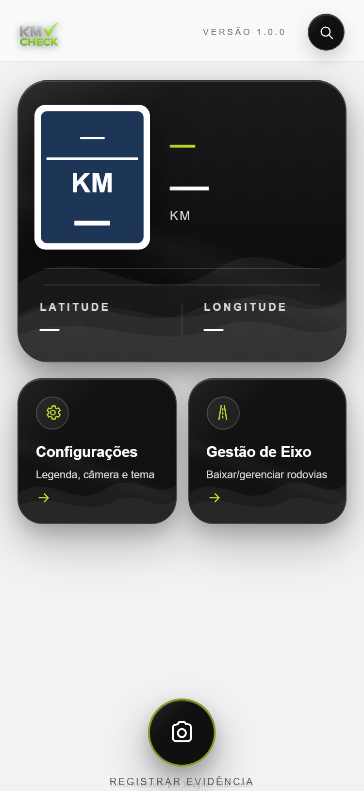
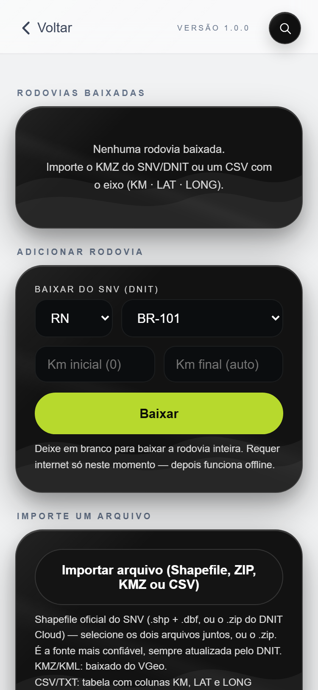
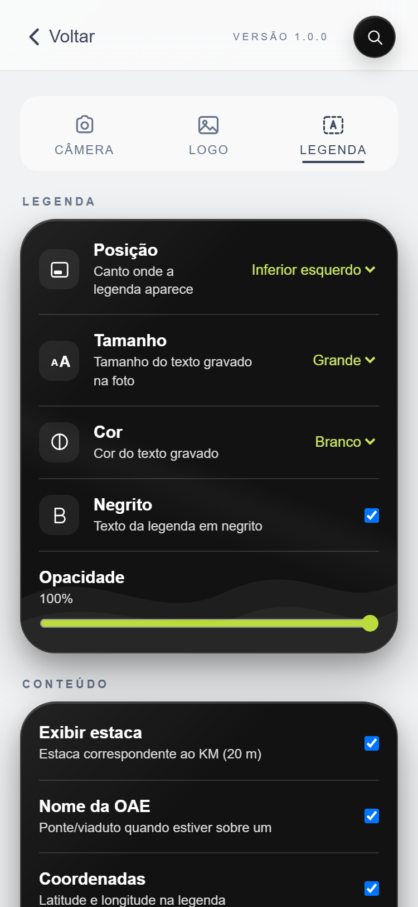
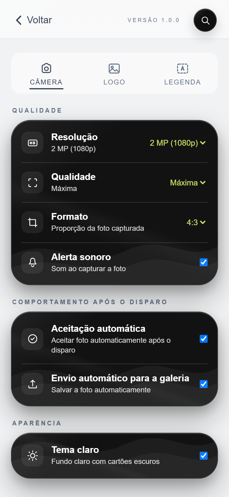

# KM Check — Manual de Instruções

**Versão do aplicativo:** 1.0.0
**Versão do manual:** 1.0
**Data de elaboração:** 31 de julho de 2026
**Elaborado por:** Wagner Machado

---

## Controle de Versão

| Versão | Data | Responsável | Descrição |
|---|---|---|---|
| 1.0 | 31/07/2026 | Wagner Machado | Versão inicial do manual |

---

## Sumário

1. [Apresentação](#apresentação)
2. [Requisitos e Compatibilidade](#requisitos-e-compatibilidade)
3. [Instalação e Primeiro Acesso](#instalação-e-primeiro-acesso)
4. [Permissões](#permissões)
5. [Tela Inicial](#tela-inicial)
6. [Cadastros e Configurações Iniciais](#cadastros-e-configurações-iniciais)
7. [Importação de Bases e Arquivos](#importação-de-bases-e-arquivos)
8. [Utilização da Câmera](#utilização-da-câmera)
9. [Posição Vertical e Horizontal](#posição-vertical-e-horizontal)
10. [Legenda da Fotografia](#legenda-da-fotografia)
11. [Localização, Rodovia e Quilômetro](#localização-rodovia-e-quilômetro)
12. [Captura e Confirmação da Fotografia](#captura-e-confirmação-da-fotografia)
13. [Salvamento na Galeria](#salvamento-na-galeria)
14. [Funcionamento Offline](#funcionamento-offline)
15. [Configurações do Aplicativo](#configurações-do-aplicativo)
16. [Mensagens e Alertas](#mensagens-e-alertas)
17. [Solução de Problemas](#solução-de-problemas)
18. [Boas Práticas em Campo](#boas-práticas-em-campo)
19. [Perguntas Frequentes](#perguntas-frequentes)
20. [Limitações Conhecidas](#limitações-conhecidas)
21. [Encerramento e Suporte](#encerramento-e-suporte)

---

## Apresentação

### Finalidade

O **KM Check** é um aplicativo para documentação fotográfica de infraestrutura rodoviária. Ele captura fotografias com legenda técnica embutida contendo identificação da rodovia, quilômetro, coordenadas geográficas, data, horário e informações complementares.

### Principais benefícios

- Identificação automática da rodovia e do quilômetro por GPS
- Legenda técnica gravada diretamente na fotografia
- Metadados EXIF com coordenadas GPS embutidos no JPEG
- Funcionamento completo offline após download dos dados
- Suporte a múltiplos formatos de importação
- Consulta bidirecional: Coordenada → KM e KM → Coordenada
- Não requer instalação pela loja de aplicativos

### Público-alvo

Profissionais de engenharia rodoviária, fiscais de obras, inspetores de rodovias, equipes de manutenção e conservação.

---

## Requisitos e Compatibilidade

| Plataforma | Navegador | Status |
|---|---|---|
| iPhone/iPad | Safari (iOS 13+) | Compatível |
| Android | Chrome (Android 7+) | Compatível |
| Desktop | Chrome/Edge | Parcial (sem câmera/GPS) |

### Recursos necessários

| Recurso | Obrigatório | Finalidade |
|---|---|---|
| Câmera | Sim | Captura de fotografias |
| GPS | Sim | Identificação de rodovia e KM |
| Internet | Apenas para download | Baixar dados do SNV/DNIT |

### Diferenças iPhone vs Android

| Recurso | iPhone | Android |
|---|---|---|
| Salvar foto | Menu de compartilhamento | Download direto |
| Vibração | Não disponível | Disponível |
| Sensor de movimento | Requer permissão | Automático |

---

## Instalação e Primeiro Acesso

### Como acessar

Abra o navegador do celular e acesse o endereço do KM Check fornecido pelo administrador.

### Adicionar à tela inicial

**iPhone (Safari):**
1. Abra o KM Check no Safari
2. Toque no botão de compartilhamento
3. Selecione “Adicionar à Tela de Início”
4. Confirme tocando em “Adicionar”

**Android (Chrome):**
1. Abra o KM Check no Chrome
2. O Chrome exibirá banner “Adicionar à tela inicial”
3. Toque em “Instalar”

### Configurações padrão (primeiro acesso)

| Configuração | Valor padrão |
|---|---|
| Resolução | 2 MP (1080p) |
| Qualidade | Máxima |
| Formato | 4:3 |
| Alerta sonoro | Ativado |
| Legenda | Grande, Negrito |
| Estaca | Ativada |
| Tema | Claro |

---

## Permissões

| Permissão | Quando solicitada | Impacto se negada |
|---|---|---|
| Localização | Ao abrir o app | Rodovia e KM não identificados |
| Câmera | Ao abrir a câmera | Não captura fotos |
| Movimento (iPhone) | Ao abrir a câmera | Legenda não gira |

> **Atenção:** Se negada, conceda a permissão nas configurações do navegador.

---

## Tela Inicial

### Componentes

| Elemento | Descrição |
|---|---|
| Cabeçalho | Logo, versão, botão consulta |
| Cartão hero | BR, KM, Estaca, Lat/Lon |
| Cartão Configurações | Acesso às configurações |
| Cartão Gestão de Eixo | Baixar/importar rodovias |
| Botão câmera | Abre a câmera (borda verde) |

---

## Cadastros e Configurações Iniciais

### Baixar rodovia
Acesse Gestão de Eixo, selecione UF e BR, toque em Baixar.

### Cadastrar serviços
Configurações → Legenda → Descrição de serviços → Adicionar.

### Cadastrar contratos
Mesmo procedimento, na seção Contratos.

---

## Importação de Bases e Arquivos

### Download do SNV (DNIT)
1. Tela Inicial → Gestão de Eixo
2. Selecione UF e BR
3. Defina KM inicial/final (opcional)
4. Toque em Baixar

### Importação de arquivo

| Formato | Arquivos | Origem |
|---|---|---|
| Shapefile | .shp + .dbf | SNV/DNIT |
| ZIP | .zip com Shapefile | DNIT Cloud |
| KMZ/KML | .kmz ou .kml | VGeo |
| CSV/TXT | .csv, .txt, .tsv | Planilha |

---

## Utilização da Câmera

### Acesso
Tela Inicial → botão câmera ou “Registrar Evidência”.

### Elementos da tela

| Elemento | Posição | Função |
|---|---|---|
| Voltar | Superior esquerdo | Fecha a câmera |
| Trocar câmera | Superior direito | Frontal/traseira |
| Proporção | Acima do visor | 1:1, 4:3, 16:9 |
| LD/LE | Lateral | Lado da pista |
| Botão “i” | Lateral | Serviço/contrato |
| Obturador | Centro inferior | Captura |
| Flash | Inferior | Liga/desliga lanterna |
| Galeria | Inferior direito | Fotos capturadas |

---

## Posição Vertical e Horizontal

- **Vertical:** posição padrão, legenda e botões normais
- **Horizontal:** legenda e logo giram automaticamente via acelerômetro; botões permanecem fixos

---

## Legenda da Fotografia

### Campos

| Linha | Conteúdo | Exemplo |
|---|---|---|
| 1 | BR/UF - KM - Lado - Estaca | BR-101/RN - KM 91,850 LD · Est. 4592+5 |
| 2 | Contrato - Serviço/OAE | CT 001/2024 - Tapa-buraco |
| 3 | Coordenadas | -6,077710, -37,891500 |
| 4 | Data e hora | 31/07/2026, 14:30 |

---

## Localização, Rodovia e Quilômetro

- GPS identifica coordenadas em tempo real
- Dados de rodovia baixados permitem identificação do KM
- Alerta ⚠ quando distante do eixo (> 300m)
- Detecção automática de OAEs
- Funciona offline após download

---

## Captura e Confirmação da Fotografia

1. Enquadre a cena
2. Verifique a legenda ao vivo
3. Pressione o obturador
4. Flash visual + som + vibração (Android)
5. Foto processada: recorte + legenda + EXIF

Nome do arquivo: `BR-XXX_UF - KM nnn,nnn LD HHMMSS.jpg`

---

## Salvamento na Galeria

- **Galeria interna:** todas as fotos ficam no app (IndexedDB)
- **Android:** download automático
- **iPhone:** menu de compartilhamento → Salvar Imagem
- Nome preservado ao enviar para Drive/OneDrive (não via WhatsApp)

---

## Funcionamento Offline

| Funcionalidade | Offline |
|---|---|
| Abrir o app | Sim |
| GPS e localização | Sim |
| Identificar KM | Sim |
| Capturar foto | Sim |
| Consultas | Sim |
| Baixar rodovia | Não |
| Atualizar app | Não |

---

## Configurações do Aplicativo

### Aba Câmera
- Resolução, Qualidade, Formato, Alerta sonoro
- Aceitação automática, Envio automático
- Tema claro/escuro

### Aba Logo
- Escolher, posicionar, ajustar opacidade e tamanho
- Recorte automático de fundo

### Aba Legenda
- Posição, Tamanho, Cor, Negrito, Opacidade
- Estaca, OAE, Coordenadas, Data, GPS
- Serviços e Contratos
- Distância de alerta

---

## Mensagens e Alertas

| Mensagem | Causa | Ação |
|---|---|---|
| Nenhuma rodovia baixada | Sem dados instalados | Baixe uma rodovia |
| ⚠ na legenda | Distante do eixo | Verifique a rodovia |
| Campos com “—” | GPS ou rodovia ausente | Verifique GPS e dados |

---

## Solução de Problemas

| Problema | Solução |
|---|---|
| Câmera não abre | Conceda permissão de câmera |
| GPS não funciona | Ative GPS e conceda permissão |
| KM não identificado | Baixe a rodovia correta |
| Legenda não gira | Conceda permissão de movimento (iPhone) |
| Offline não funciona | Acesse com internet primeiro |

---

## Boas Práticas em Campo

### Antes
1. Baixe as rodovias necessárias
2. Cadastre serviços e contratos
3. Verifique permissões e teste GPS
4. Carregue o aparelho

### Durante
1. Limpe a lente
2. Confira a legenda ao vivo
3. Selecione o lado correto (LD/LE)
4. Pare o veículo para fotografar

> **Segurança:** Não manuseie o celular enquanto dirige.

---

## Perguntas Frequentes

**Precisa de internet?** Não, após baixar as rodovias.

**Precisa baixar pela loja?** Não, funciona pelo navegador (PWA).

**A legenda pode ser removida?** Não, é gravada permanentemente.

**Funciona em rodovias estaduais?** Sim, importando CSV ou Shapefile.

**As fotos têm GPS embutido?** Sim, nos metadados EXIF.

---

## Limitações Conhecidas

| Limitação | Descrição |
|---|---|
| Vibração no iPhone | Safari não suporta |
| Nome via WhatsApp | WhatsApp renomeia arquivos |
| OAEs | Limitadas ao RN (55 estruturas) |
| Resolução máxima Android | Alguns dispositivos limitam a 1080p |

---

## Encerramento e Suporte

- Versão atual: 1.0.0 (exibida na Tela Inicial)
- Atualização automática pelo Service Worker
- Ao reportar problemas, informe: dispositivo, navegador, descrição e captura de tela

**Desenvolvido por Wagner Machado**
Base geométrica: SNV/DNIT
